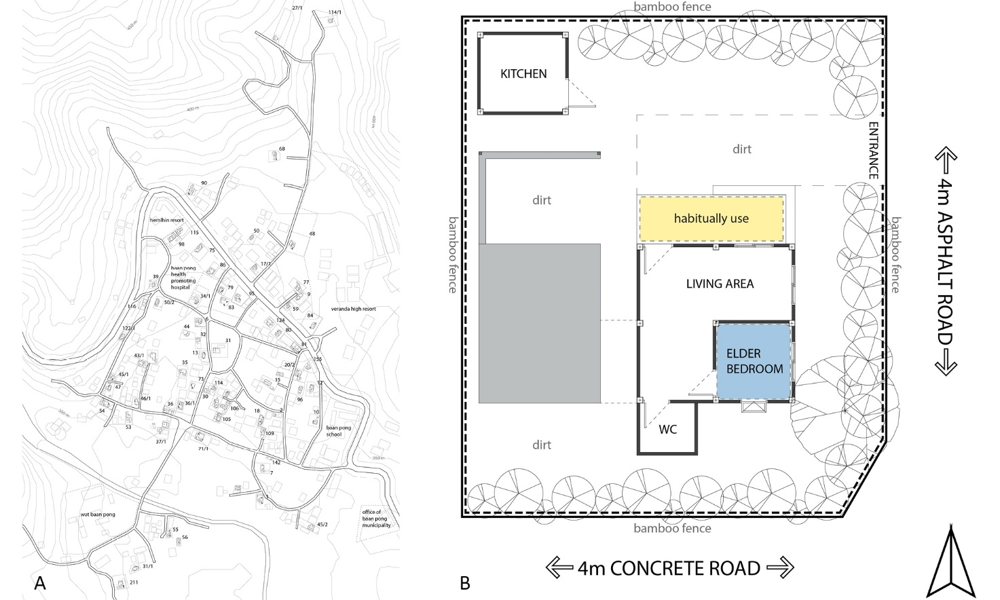

# THE RESIDENTIAL SITES ENVIRONMENT FOR OLDER ADULTS IN A RURAL ASIAN CONTEXT FROM A CASE STUDY OF A VILLAGE IN NORTHERN THAILAND

## Authors

- Alisa Hongthong (1), (\*)
- Patricia Noxolo (1)
- Lloyd Jenkins (1)
- Yueming Zhang (2)

(1) School of Geography, Earth and Environmental Sciences, University of Birmingham, Birmingham, UK
(2) School of Environment, Education and Development, The University of Manchester, Manchester, UK
(\*) corresponding authors (AH: axh798@student.bham.ac.uk, alisa.hthong@gmail.com)

## About the authors

Alisa Hongthong is a doctoral student working alongside Drs Patricia Noxolo and Lloyd Jenkins from the Department of Geography, Earth and Environmental Sciences at the University of Birmingham, UK. Together with Dr Yueming Zhang from the School of Environment, Education and Development at the University of Manchester, UK. 

## Acknowledgments

Alisa Hongthong acknowledges the funding support from the Chiang Mai University, Thailand and School of Geography, Earth and Environmental Sciences, University of Birmingham, UK.

## Keywords

Person-Environment (P–E) fit, residential sites environment, mixed methods, preferences, perceptions

## Highlight text

Unlike most of earlier works on environments for elders, this study focuses exclusively on residential sites in a rural Asian context from a case study of a village in northern Thailand, with a mixed methodology based on the extent of Person-Environment (P–E) fit as it is critical to older people’s quality of life. 

## Figure

Figure A and B: Town plan with the contour of a case study of a village in Thailand with the locations of older adults’ residential sites (A) and an example of a case study of a residential site plan (B), (Hongthong 2019).

## Abstract

### Background

Old age is a critical stage of life, the influences of which can be identified from the physical environment. Seniors spend most of the time in the dwelling environment and the environment immediately adjacent to their dwelling, which is the residential site (Rantakokko et al. 2013, Wahl and Oswald 2010). The typical residential site environment’s design features can promote older adults’ interactions with outdoor environments or limit their physical activities in their yards (Wang and Lee 2010, Wang, Rodiek, and Shepley 2006). Although the most important environment for the elderly is well described, the perceptions of older people within residential site environmental settings and their features have yet to be studied in-depth in non-Western contexts, particularly in Asian countries within rural settings (Wang, Rodiek, and Shepley 2006). As critical points of at least two inter-related gaps, this study addresses these gaps in the ASEAN context by extending the focus of environment of ageing. The residential site environment has been a significant subject of research in a field called ‘environmental gerontology’ (EG) (Iwarsson 2005), which involves a dynamic relationship between the ageing person (P) and their environment (E), known as person-environment (P-E) fit. Thus, the principal research aims of this project are to understand how older adults perceive, utilise, and relate to their residential site environments in a rural context which evaluated by older people themselves in a case study of a village in northern Thailand. This study is useful for residential and rural development, to improve and create appropriate residential site environments for older adults in other ASEAN countries or related contexts and in confronting ageing societies.

### Method

The rural area in Baan Pong Nuea, a sub-district municipality of the Hang Dong district in Chiang Mai province, located in northern Thailand, is presented as a case study in this research with the mixed methods approach. The sample size of 90 older participants was classified into two groups at the Early Stage (60-74 years old) of 60 inhabitants and the later stage (75 years old and above) of 30 inhabitants. Due to the sample size, data availability, and the culture of the participants, a mixed-methods approach was considered the most appropriate way to conduct this research which included questionnaires, interviews and observations. The quantitative data collection methods were from the questionnaires, which provided information on the personal and social data, the environmental context of dwellings and components in the residential site. In the qualitative part, the data was collected through in-depth investigation, following interview guidelines and fieldworks. Content analysis and descriptive statistics were employed using SPSS software for data analysis.

### Result

The results revealed a high appreciation of safety and functionality of residential sites’ environment at site and dwelling levels respectively. The findings also indicate the strong associations between residential sites typology at both levels and perceived residential sites typology, motivators, functionality and safety. The characteristics of safety, green and pleasant spaces and functional areas for activities were some key elements elders particularly appreciate. These are evidenced by older people’s strong willingness to use the environment, as well as their perceptions that nature and physical settings in residential sites environment have advantages influencing behaviour. Furthermore, a relatively strong sense of place attachment was revealed among the older people’s strong willingness to use the environment, as well as their perceptions that nature and physical settings in residential sites environment have advantages influencing behaviour. 

### Discussion and conclusion

The study provides significant findings that add to existing studies on P-E fit interactions. First, the study confirms that residential sites environment is a ‘setting for action’ with those environmental characteristics necessary for the pursuit of desired outdoor activities (Williams and Patterson 2008, Sun, Phillips, and Wong 2018). However, residential sites environmental characteristics at different levels are essential to creating appropriate relationships between older people and their places by conducive to active functioning and positive feelings in those environments. Specifically, the analysis indicates that ‘natural environment’, the trees, vegetations or green areas environments and amenities, are perceived to possess ecological, aesthetical and affective functions for people’s active and healthy behaviours, highlighting elders’ love of being close to nature and greenery. These older people’s perspective links with their residential site environment across time and their unique life-course experiences will help to explain their preferences or perceptions of their environment in the rural context.

### References

Iwarsson, Susanne. 2005. "A long-term perspective on person-environment fit and ADL dependence among older Swedish adults." The Gerontologist no. 45 (3):327-336.
Rantakokko, Merja, Timo Törmäkangas, Taina Rantanen, Maria Haak, and Susanne Iwarsson. 2013. "Environmental barriers, person-environment fit and mortality among community-dwelling very old people." BMC Public Health no. 13:783-783.
Sun, Yi, David R. Phillips, and Moses Wong. 2018. "A study of housing typology and perceived age-friendliness in an established Hong Kong new town: A person-environment perspective." Geoforum no. 88:17-27.
Wahl, Hans Werner, and Frank Oswald. 2010. "The SAGE Handbook of Social Gerontology." In. London: SAGE Publications Ltd.
Wang, Zhe, and Chanam Lee. 2010. "Site and neighborhood environments for walking among older adults." Health & Place no. 16 (6):1268-1279.
Wang, Zhe, Susan Rodiek, and Mardelle Shepley. 2006. Residential Site Environments and Yard Activities of Older Adults. In Report on University Research: Texas A&M University.
Williams, Daniel, and Michael Patterson. 2008. "Place, Leisure, and Well-being Place." In, 105-11

# สภาพแวดล้อมที่อยู่อาศัยสำหรับผู้สูงอายุในบริบทชนบทแห่งเอเชีย จากกรณีศึกษาหมู่บ้านในภาคเหนือของประเทศไทย

## โดย

- อลิษา หงษ์ทอง (1), (\*)
- แพทริเซีย โนโซโล (2)
- ลอยด์ เจนกินส์ (2)
- ยูมิง ซาง (3) 

(\*) axh798@student.bham.ac.uk, alisa.hthong@gmail.com

## ประวัตินักวิจัย

นางสาว อลิษา หงษ์ทอง
- นักศึกษาปริญญาเอก, ภาควิชาภูมิศาสตร์ โลก และวิทยาศาสตร์สภาพแวดล้อม, มหาวิทยาลัยเบอร์มิงแฮม, ประเทศอังกฤษ
- ดร., ภาควิชาภูมิศาสตร์ โลก และวิทยาศาสตร์สภาพแวดล้อม, มหาวิทยาลัยเบอร์มิงแฮม, ประเทศอังกฤษ
- ดร., ภาควิชาสิ่งแวดล้อม การศึกษา และการพัฒนา, มหาวิทยาลัยแมนเชสเตอร์, ประเทศอังกฤษ

## คำสำคัญ

ความสอดคล้องระหว่างบุคคลกับสภาพแวดล้อม (Person-Environment (P–E) fit), สภาพแวดล้อมที่อยู่อาศัย, การวิจัยแบบผสมผสาน, ความชื่นชอบ, การรับรู้

## บทคัดย่อ

งานวิจัยนี้ได้ทำการศึกษาสภาพแวดล้อมที่อยู่อาศัยสำหรับผู้สูงอายุ จากการรับรู้และการประเมินของผู้สูงอายุที่มีต่อสภาพแวดล้อมที่อยู่อาศัยจากแนวคิดด้านบุคคลกับสภาพแวดล้อม ซึ่งงานวิจัยนี้มีแนวทางที่แตกต่างจากการศึกษาด้านสภาพแวดล้อมสำหรับผู้สูงอายุโดยส่วนใหญ่ โดยในการศึกษาครั้งนี้จะเป็นการมุ่งเน้นสภาพแวดล้อมที่อยู่อาศัยในบริบทชนบทแห่งเอเชีย จากกรณีศึกษาหมู่บ้านในภาคเหนือของประเทศไทยด้วยวิธีการวิจัยแบบผสมผสาน ภายใต้แนวคิดด้านความสอดคล้องระหว่างบุคคลกับสภาพแวดล้อม (Person-Environment (P–E) fit) เนื่องจากแนวคิดนี้มีความสำคัญต่อคุณภาพชีวิตของผู้สูงอายุ การศึกษาครั้งนี้มีวัตถุประสงค์เพื่อประเมินถึงคุณลักษณะของสภาพแวดล้อมที่อยู่อาศัยที่มีความสำคัญต่อผู้สูงอายุ จากการประเมินในระดับของพื้นที่อยู่อาศัยและพื้นที่สภาพแวดล้อม และเพื่อศึกษาว่าคุณลักษณะเฉพาะของสภาพแวดล้อมใดที่มีความเหมาะสมและส่งผลกระทบต่อการใช้งานและความพึงพอใจต่อสภาพแวดล้อมของผู้สูงอายุ ซึ่งมีการเก็บข้อมูลด้วยแบบสอบถามและการสัมภาษณ์จากผู้สูงอายุจำนวน 90 คน รวมถึงข้อมูลภาคสนามของสภาพแวดล้อมที่อยู่อาศัย ซึ่งจากการศึกษาพบว่าคุณลักษณะด้านความปลอดภัย พื้นที่สีเขียวที่มีความน่ารื่นรมย์ และคุณลักษณะทางการใช้งานของสภาพแวดล้อมที่อยู่อาศัย ในระดับพื้นที่สภาพแวดล้อมและระดับพื้นที่อยู่อาศัยเป็นองค์ประกอบสำคัญที่ผู้สูงอายุให้ความชื่นชอบมากที่สุด โดยการศึกษานี้สามารถช่วยอธิบายการรับรู้สภาพแวดล้อมที่อยู่อาศัยที่เหมาะสมสำหรับผู้สูงอายุในบริบทชนบท ซึ่งอาจนำไปสู่การเสนอแนะแนวทางการพัฒนาในรูปแบบนโยบายหรือโครงการพัฒนาอื่น ๆ ที่เหมาะสม มีประสิทธิผล และตอบสนองต่อความต้องการที่แท้จริงของผู้สูงอายุแห่งสังคมผู้สูงวัยในประเทศไทยต่อไป