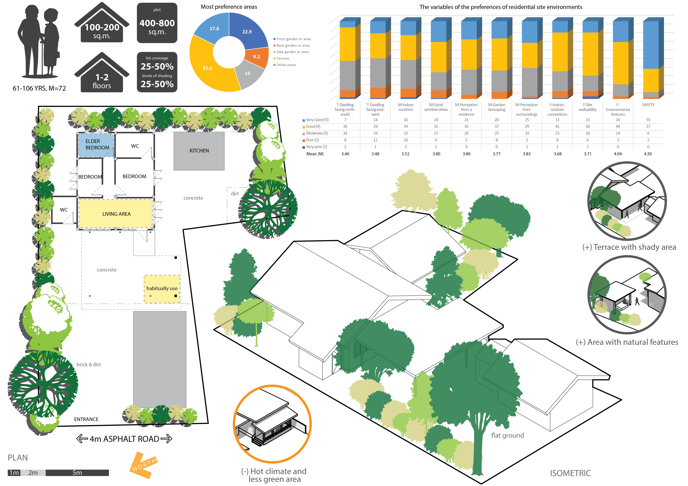

# The residential site environmental preferences of older adults in a rural Asian context from a case study of a village in Northern Thailand

Received: 04 February 2020, Accepted: 10 June 2020, Published: 26 July 2020

## Authors

- Alisa Hongthong \*
- Patricia Noxolo
- Lloyd Jenkins
- Yueming Zhang

\* corresponding author (axh798@student.bham.ac.uk, alisa.hthong@gmail.com)

## Highlight text

This study examines elders’ preferences for residential site environments from their perceptions and evaluations. Unlike most earlier works on environments for elders, the study focuses on residential sites in a rural Asian context, with a mixed-methodology based on the extent of Person-Environment (P–E) fit. This will help to understand and identify the preferences of residential site environmental characteristics in a rural context. 

## Keywords

Person-Environment (P–E) fit, preferences, residential sites environment, ageing society, mixed-methods 

## Figure

Example of residential site environmental characteristics from the preferences of older adults and descriptive data (Hongthong 2019).

## Abstract

### Background

Old age is a critical stage of life, in which a person's physical environment plays an important role. Seniors spend most of their time in the dwelling environment and the environment immediately adjacent to their dwelling, which is the residential site (Rantakokko et al. 2013, Wahl and Oswald 2010). The typical residential site environment’s design features can promote older adults’ interactions with outdoor environments or limit their physical activities in their gardens (Wang and Lee 2010, Wang, Rodiek, and Shepley 2006). Although the most important characteristics of a good environment for the elderly is well described, the perceptions of older people within residential site environmental settings and their features have yet to be studied in-depth in non-Western contexts, particularly in Asian countries within rural settings (Wang, Rodiek, and Shepley 2006). As critical points of at least two inter-related gaps, this study addresses these gaps in the South-East Asian context by widening the focus on the environment of ageing. The residential site environment has been a significant subject of research in a field called ‘Environmental Gerontology’ (EG) (Iwarsson 2005). It involves a dynamic relationship between the ageing person (P) and their environment (E), known as person-environment (P-E) fit, which is critical to older people’s quality of life. Thus, the principal research aims of this project are to understand how older adults perceive, utilise, and relate to their residential site environments in a rural context as evaluated by older residents themselves in a case study of a village in northern Thailand. The key research question is ‘What are the preferences for environmental features among elders in the rural residential sites?’ Older people’s perceptions of their residential site environments will help explain their preferences for their environment in the rural context.

### Method

The rural area in Baan Pong Nuea, a sub-district municipality of the Hang Dong district in Chiang Mai province, northern Thailand, is presented as a case study in this research because it has a higher number of elderly than other villages (Noichan, 2011). The samples of 90 older participants were classified into two groups at the Early Stage (60-74 years old, 60 inhabitants) and the Later Stage (75 years old and above, 30 inhabitants). Their environmental perceptions were studied in four main parts which included the typology, motivator, functionality, and safety. Due to the sample size, data availability, and the culture of the participants, a mixed-methods approach was considered the most appropriate way to conduct this research which included questionnaires, interviews, and observations. The quantitative data collection method was from the questionnaire and analysed using SPSS, which consisted of socio-demographic data and the preferences for environmental components. In the qualitative part, the data was collected through an in-depth investigation of two parts: guideline-structured interviews, and fieldwork. These were grouped into themes and analysed through content analysis.

### Result

It was found that the most preferred area in residential sites is the terrace (37.4%). The results also revealed the highest preference for safety (M=4.50) and lowest preference for dwelling orientation with respect to the sun (facing north-south, M=3.46). The orientation facing east-west (M=3.48) has more preference than north-south. The preference for several motivators was rated as moderate to good, which are; the perception of surrounding area or neighbourhood (M=3.83), perception within a residence and good window-views (M=3.80), garden landscaping (M=3.77) and pleasant indoor sunshine (M=3.52), respectively. The functionality factors were also rated as moderate to good. These factors include environmental features (M=4.04), site walkability (M=3.71), and indoor-outdoor connections (M=3.68), respectively. According to the qualitative data, the characteristics of safety, green and pleasant spaces and functional areas for activities were some key elements elders particularly appreciate, but they also perceived negative feelings about sunshine and a hot climate. These are evidenced by elders’ strong willingness to use the environment. This is based on their preference of the desirable nature and physical settings in residential site environments. This is shown to have advantages influencing their behaviour.

### Discussion and conclusion

The study provides significant, new findings in addition to those already found from existing studies on P-E fit interactions. The study confirms that the residential site environment is a ‘setting for action’ with those preferences of environmental characteristics necessary for the pursuit of desired outdoor activities (Williams and Patterson 2008, Sun, Phillips, and Wong 2018). The evidence presented in the study suggests that preferences for residential sites’ environmental characteristics a
re essential to creating appropriate relationships between elders and their places by being conducive to active functioning, and also affect positive and negative feelings towards those environments. Specifically, the elders’ perspectives indicate that the environmental preferences of safety, natural features, shady areas, and amenities are perceived to possess ecological, aesthetical, and affective functions for people’s active and healthy behaviours. This study could lead to residential and rural development policy interventions and has implications for practice. The guidelines from this study allow elders or related organizations to promote, apply and create the appropriate and desirable residential environments in confronting an ageing society.

### About the authors

Alisa Hongthong is a doctoral student working alongside Drs Patricia Noxolo and Lloyd Jenkins in the Department of Geography, Earth and Environmental Sciences at the University of Birmingham, and Dr Yueming Zhang from the School of Environment, Education and Development at the University of Manchester, UK. 

### Acknowledgements

Alisa Hongthong acknowledges funding support from Chiang Mai University, Thailand and the School of Geography, Earth and Environmental Sciences, University of Birmingham, UK.

### References

- Iwarsson, Susanne. 2005. "A long-term perspective on person-environment fit and ADL dependence among older Swedish adults." The Gerontologist no. 45 (3).
- Noichan, Wanchai. 2011. Development of Personal Health Care Abilities in the Elderly of Pong Nuea Village, Hang Dong District, Chiang Mai Province, Faculty of Education, Chiang Mai University, Chiang Mai.
- Rantakokko, Merja, Timo Törmäkangas, Taina Rantanen, Maria Haak, and Susanne Iwarsson. 2013. "Environmental barriers, person-environment fit and mortality among community-dwelling very old people." BMC Public Health no. 13:783-783.
- Sun, Yi, David R. Phillips, and Moses Wong. 2018. "A study of housing typology and perceived age-friendliness in an established Hong Kong new town: A person-environment perspective." Geoforum no. 88:17-27.
- Wahl, Hans Werner, and Frank Oswald. 2010. "The SAGE Handbook of Social Gerontology." In. London: SAGE Publications Ltd.
- Wang, Zhe, and Chanam Lee. 2010. "Site and neighborhood environments for walking among older adults." Health & Place no. 16 (6):1268-1279.
- Wang, Zhe, Susan Rodiek, and Mardelle Shepley. 2006. Residential Site Environments and Yard Activities of Older Adults. In Report on University Research: Texas A&M University.
- Williams, Daniel, and Michael Patterson. 2008. "Place, Leisure, and Well-being Place." In, 105-119.

### License
 
This work is licensed under a Creative Commons Attribution-NonCommercial-ShareAlike 4.0 International (CC BY-NC-SA 4.0) License, which permits to copy and redistribute the material in any medium or format. You are also allowed to remix, transform, and build upon the material under the following terms: 1) You must give appropriate credit, provide a link to the license, and indicate if changes were made. 2) You may not use the material for commercial purposes. 3) If you remix, transform or build upon the material, you must distribute your contributions under the same license as the original. To view a copy of this license, visit https://creativecommons.org/licenses/by-nc-sa/4.0/