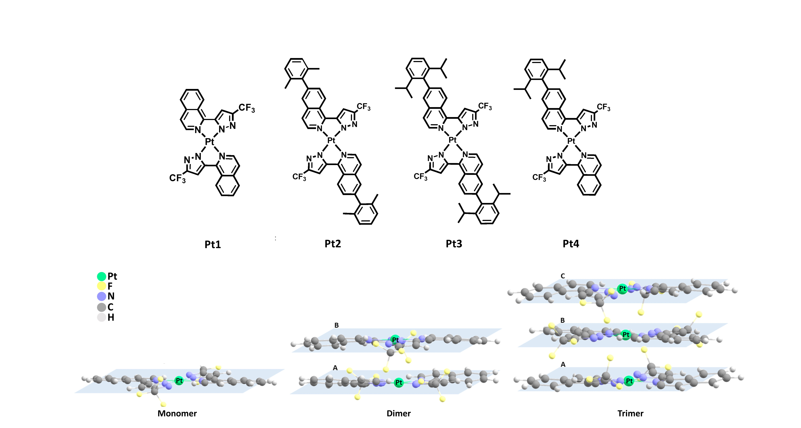

# Cooperativity in non-covalent metallophilic Pt···Pt interaction of aggregated square-planar Pt(II) complexes bearing isoquinolinyl pyrazolate: Theoretical insights

Science & Engineering (Received: 13 February 2020, Accepted: 03 June 2020, Published: 26 July 2020)

## Authors

- Chattarika Sukpattanacharoen
- Prashant Kumar
- Nawee Kungwan (NK) \*
- Daniel Escudero (DE) \*

\* corresponding authors (NK: naweekung@gmail.com, DE: daniel.escudero@kuleuven.be)

## Highlight text

Pt···Pt contacts are more evident in the trimer aggregates rather than in the dimer ones, and especially in the case of the T1 optimized geometries. Esyn and E-EA values indicate a positive synergy between both interactions which is in good agreement with the shortening of the equilibrium distance in T1 state. The EDA reveals that the ∆Etot of trimer Pt1a is controlled by the ∆Eele and ∆Edisp terms.

## Keywords

Isoquinolinyl pyrazolate Pt(II) complex; Cooperativity in non-covalent interactions; Cooperativity effects; Energy decomposition analysis (EDA)

## Figure

Scheme 1. Molecular geometry of monomer Pt1-Pt4 and schematic representation of monomer, dimer, and trimer.

## Abstract

### Background

Non-covalent interactions are crucial in many areas of material science, biology, medicine, and modern chemistry, especially in the field of supramolecular chemistry. In this field, they are responsible for the variations in the chemical and physical properties of single molecules when moving to condensed phases, for example, in liquid and solid states. Molecules are individual building blocks and the way in which they organize themselves to have a great impact on their properties. Importantly, the photophysical properties of the molecular aggregates might strongly differ from those of the isolated units. Aggregation might be originated from subtle changes in the environment and thus their application in the field of chemosensors, bioprobes, stimuli-responsive nanomaterials, and optoelectronic materials is straightforward. Generally, Pt(II) metal complexes display square planar molecular geometries. Thus, the formation of dimer/aggregate species is common for these complexes. In the aggregates, the corresponding excited states involved in their emissive properties often possess significant metal-metal-to-ligand charge transfer (MMLCT) character. In previous work, we first synthesized square-planar Pt(II) complexes bearing isoquinolinyl pyrazolate. The results reveal that the conformational flexibility and the interlayer distance are the most important factors controlling the character of the excited state in the aggregates. Herein, we aim first to understand the packing interactions in aggregated species of dimer and trimer Pt1-Pt4 (Scheme 1) and to evaluate possible cooperativity effects in the aggregated species when going from the dimer to the trimer species. The packing information and cooperativity effect of trimer species in Pt1-Pt4 are analyzed in terms of geometric and energetic factors including the synergetic energy, non-additivity energy, and energy decomposition analysis.

### Method

In this study, we present the cooperativity effect of the non-covalent of isoquinolinyl pyrazolate Pt(II) complexes that are devoted to manipulating their metallophilic Pt···Pt interactions by using density functional theory (DFT) and unrestricted DFT (UDFT). The spectroscopic properties are calculated with time-dependent DFT (TD-DFT). To evaluate the possible co-existence of non-covalent interactions, their additivity energies were calculated. Synergetic and cooperativity energies were also computed. The EDA of dimer and trimer Pt1-Pt4 were performed based on the generalized Kohn-Sham (GKS) scheme, i.e., GKS-EDA. All calculations were carried out with the Gaussian 16 program packages at the B3LYP-D3/6-31G(d) level of theory. The EDA analysis was performed with the Turbomole 7.1 program package, at the B3LYP-D3/def2-TZVP level of theory.

### Result

The results highlight that there are some degrees of conformational flexibility for dimers and trimers at room temperature. Two main intermolecular forces drive the dimer and trimer assembly intermolecular π···π stacking interactions and Pt···Pt contacts. The former interaction is predominant in all investigated dimer species, regardless whether we consider the S0 or the T1 optimized geometries. The interlayer distances range between 3.3 and 3.6 Å. The computed geometric features at the trimer structures point to strong cooperativity effects when going from dimers to trimers in T1 state. Indeed, the computed Esyn and E-EA values also highlight the strong cooperative effects in Pt1a. Thus, while the Esyn and E-EA values for trimer Pt1a in S0 amount only up to a few kcal/mol (amount up to -54.8 and -131.0 kcal/mol in the T1 state, respectively). Esyn and E-EA values indicate a positive synergy between both interactions which are in good agreement with the shortening of the equilibrium distance in T1 state. This trend is not only observed from Pt1a but can also be seen in the rest of the complexes. The energy decomposition analysis reveals that the ∆Etot of trimer Pt1a is controlled by the ∆Eele and ∆Edisp terms. The ∆Epol term is always small. The relative stability of the interaction in S0 state compared to that of in T1 state is mainly attributed to the ∆Eele and ∆Edisp energies.

### Discussion and conclusion 

We stress the importance of synergistic effects between non-covalent metallophilic Pt···Pt interactions which could be relevant to rationalize the relevant geometric differences between the conformers. We recall that these changes are associated with a striking change in their photophysical properties. The results indicate that Pt···Pt contacts become more relevant in the trimer structures rather than dimer conformers, especially in their T1 excited states. From EDA analysis, the ∆Etot of trimers is mainly controlled by the ∆Eele and ∆Edisp terms. 

### About the authors

Ms Sukpattanacharoen is a PhD student, under the supervision of Asst. Prof. Kungwan, at the Department of Chemistry, Faculty of Science, Chiang Mai University, Thailand. Mr Kumar is a PhD student, under supervision of Prof. Escudero at Department of Chemistry, KU Leuven, Belgium. This work has been done in collaboration with Prof. Escudero and Asst. Prof. Kungwan who are the major contributors to this work for the initial idea, project design, and computational resources. All theoretical calculations have been performed at Prof. Escudero’s laboratory.

### Acknowledgements

CS would like to thank The Science Achievement Scholarship of Thailand (SAST) for a PhD fellowship. NK would like to thank Chiang Mai University for partially financial support. PK and DE acknowledge funding from Internal Funds KU Leuven, Department of Chemistry, KU Leuven, Belgium and Graduate School of Chiang Mai University, Chiang Mai, Thailand are also acknowledged.

### References

- Mahadevi, A. Subha, and G. Narahari Sastry. 2016 "Cooperativity in noncovalent interactions." Chemical reviews 116 (5): 2775-2825.
- Sathish, Veerasamy, Arumugam Ramdass, Pounraj Thanasekaran, Kuang-Lieh Lu, and Seenivasan Rajagopal. 2015. "Aggregation-induced phosphorescence enhancement (AIPE) based on transition metal complexes—An overview." Journal of Photochemistry and Photobiology C: Photochemistry Reviews 23: 25-44.

## License
 
This work is licensed under a Creative Commons Attribution-NonCommercial-ShareAlike 4.0 International (CC BY-NC-SA 4.0) License, which permits to copy and redistribute the material in any medium or format. You are also allowed to remix, transform, and build upon the material under the following terms: 1) You must give appropriate credit, provide a link to the license, and indicate if changes were made. 2) You may not use the material for commercial purposes. 3) If you remix, transform or build upon the material, you must distribute your contributions under the same license as the original. To view a copy of this license, visit https://creativecommons.org/licenses/by-nc-sa/4.0/