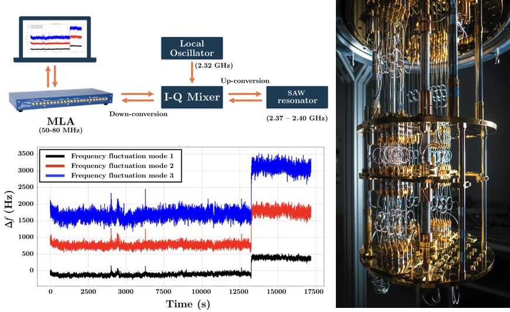

# Investigating a challenge of building a superconducting quantum computer

Received: 17 February 2020, Accepted: 10 June 2020, Published: 26 July 2020

## Second title

Probing two-level systems with a surface acoustic wave resonator

## Authors

- Nuttamas Tubsrinuan \*
- Gustav Andersson Per Delsing 

\* corresponding author (nuttamas@student.chalmers.se)

## Highlight text

Parasitic two-level systems (TLS) coupling to a superconducting quantum circuit causes information loss. To mitigate this problem, a better physical understanding of the coupling mechanism is crucial. Phase noise caused by TLS interaction is investigated by using a surface acoustic wave resonator. The results show a significant correlation of resonance frequency fluctuations between different resonance modes, supporting the prediction of the TLS model.

## Keywords

superconducting quantum computer, quantum circuit, two-level system, surface acoustic wave resonator, resonance frequency fluctuations

## Figure

(Top left) schematic of the measurement setup, (right) a dilution refrigerator that hosts a SAW resonator, and (bottom left) resonance frequency fluctuations calculated from three different modes of a SAW resonator, showing similar features.

## Abstract

### Background

Quantum computing shows high potential to overcome the computational limit of classical computers and offer computational power beyond current state-of-the-art technology. To implement the concept of quantum computing, a reliable fundamental unit of information, the quantum bit (qubit), must be achieved. One of the proposed candidates for qubit that is promising for the transfer from the research field towards real-world applications is the superconducting qubit. Despite having the advantages of scalability and compatibility with existing microwave control systems, the energy loss in a superconducting quantum circuit due to the coupling with parasitic two-level system (TLS) defects remains unsolved. 
TLSs can be classified as coherent TLS and incoherent TLS. Previous studies, e.g. Burnett et al. (2014), and Müller et al. (2015), showed that coherent TLSs directly couple with a superconducting circuit. Meanwhile, incoherent TLSs interact with coherent TLSs, bringing the coherent TLSs in and out resonance with our system. This effect results in resonance frequency fluctuations. The conventional approach for monitoring TLS interaction is to measure phase noise in either a superconducting qubit or a microwave resonator. However, those devices only allow the study of TLS interaction at one specific resonance frequency. 
A surface acoustic wave (SAW) resonator has shown its advantage for the study of the interaction between the acoustic field and a quantum device (Manenti et al., 2017). Since an acoustic wave has a much lower velocity than an electromagnetic wave, a SAW resonator contains many resonance modes in limited chip size. This permits the study of the interaction between TLSs in different modes, rather than only one mode inside a microwave resonator. 

### Method

A surface acoustic wave resonator is utilized as a tool for probing TLSs. A SAW resonator is mounted inside a dilution refrigerator, keeping the temperature approximately at 10 mK. A multi-frequency lock-in amplifier (MLA) connected with a frequency mixer generates high-frequency signals corresponding to SAW resonator frequencies simultaneously. The reflected signals from the resonator contain phase noise, which is the effect of TLS coupling. Phase noise data are used to calculate resonance frequency fluctuations for each mode. Then, the correlations of the resonance frequency fluctuations between different modes are determined.
A script for measurement is written in python. A CircleFit notebook (Probst et al., 2015) is utilized for fitting resonator parameters. Finally, data analysis is performed using Matlab and python.
 
### Result

The preliminary result indicates the relationship of frequency fluctuations among different modes of a SAW resonator. Further analysis reveals significant correlation coefficients and indicates that the correlation of resonance frequency fluctuations decreases with increasing detuning. In addition, the degree of correlation shows power dependence, which remains to be investigated.

### Discussion and conclusion

This work experimentally demonstrates that phase noise in different modes is correlated, providing the evidence of interaction between incoherent TLSs and coherent TLSs as the cause of this phenomenon.

### About the authors

Ms Nuttamas Tubsrinuan is an Erasmus Mundus Master of Nanoscience and Nanotechnology, specializing in quantum computing. She is studying in the joint-degree program between KU Leuven, Belgium and Chalmers University of Technology, Sweden. This work is conducted under the supervision of Gustav Andersson and professor Per Delsing at the Quantum Technology laboratory (QT), Chalmers University of Technology and the Wallenberg Center for Quantum Technology (WACQT), Sweden.

### Acknowledgements

NT acknowledges the European Commission for the Erasmus Mundus scholarship and Chalmers University of Technology and WACQT for the laboratory facilities.

### References

- Müller, C., Lisenfeld, J., Shnirman, A, and Poletto, S. 2015. “Interacting two-level defects as sources of fluctuating high frequency noise in superconducting circuits”. Physical Review B, 92(3): 305442.
- Burnett J., Faoro, L., Wisby, I. Gurtovio, V.L., Chernykh, A.V., Mikhailoz, G.M., Tulin, V.A., Shailhaidarov,  R., Antonov, V., Meeson, O.J., Tzalenchuk, A.Y. and Linström, T. 2014. 
“Evidence for interacting two-level systems for the 1/f noise of a superconducting 
resonator”. Nature Communication (5): 4119.
- Probst, S., Song, S.B., Pushen, P.A., Ustinov, A.V., and Weides, M. 2015. “Efficient and robust analysis of complex scattering data under noise in microwave resonators”. Review of Scientific Instrument (86): 024706.
- Manenti, R., Kockum, A.F., Patterson, A., Behrle, T., Rahamim, J., Tancredi, G., Nori, F., and Leek, P.J.. 2017. “Circuit quantum acoustodynamics with surface acoustic waves”. Nature 
Communications (8): 975.

## License

This work is licensed under a Creative Commons Attribution-NonCommercial-ShareAlike 4.0 International (CC BY-NC-SA 4.0) License, which permits to copy and redistribute the material in any medium or format. You are also allowed to remix, transform, and build upon the material under the following terms: 1) You must give appropriate credit, provide a link to the license, and indicate if changes were made. 2) You may not use the material for commercial purposes. 3) If you remix, transform or build upon the material, you must distribute your contributions under the same license as the original. To view a copy of this license, visit https://creativecommons.org/licenses/by-nc-sa/4.0/
