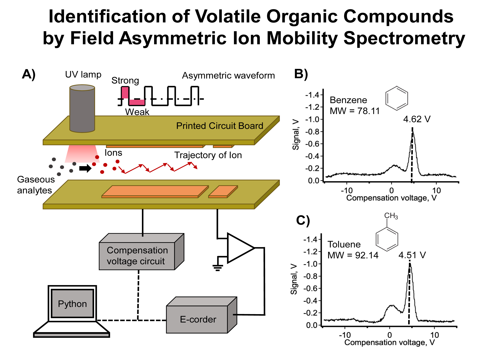

# Identification of volatile organic compounds by use of Field Asymmetric Ion Mobility Spectrometry

Received: 28 February 2020, Accepted: 06 June 2020, Published: 26 July 2020

## Authors

- Nattapong Chantipmanee \*
- Peter C. Hauser

\* corresponding author (Chantipmanee.n@hotmail.com)

## Highlight text

Field Asymmetric Ion Mobility Spectrometer (FAIMS) provides rapid (30 seconds for a sample) analysis under atmospheric pressure. 

## Keywords

Volatile organic compounds, Field asymmetric ion mobility spectrometry, Rapid analysis

## Figure

A) Schematic diagram of VOCs movement in Field Asymmetric Ion Mobility Spectrometer and its connection to obtain peak profiles of B) benzene (MW = 78.11) at 4.62 V and C) Toluene (MW = 92.14) at 4.51 V

## Abstract

### Background

Field Asymmetric Ion Mobility Spectrometry (FAIMS) is one of the Ion Mobility Spectrometry (IMS) techniques. FAIMS is a very sensitive technique that can identify gaseous phase ions under atmospheric pressure. FAIMS has been developed for decades for simple and fast analysis applied to a broad range of applications in military, agriculture, and pharmaceutical research (Eiceman, Karpas, and Hill 2013, Kolakowski and Mester 2007). Most of the compounds of interest are Volatile Organic Compounds (VOCs) (Chavarria et al. 2017). Separation and identification of VOCs at atmospheric pressure can be achieved. In the work, benzene and toluene as VOCs were identified by FAIMS. Each VOC is transported in the air as carrier gas by a UV lamp with a specific wavelength to ionize analytes of interest. The ions were passed through a separation region which consists of two parallel electrodes. One electrode was connected to an asymmetric waveform. The trajectories of ions were dispersed by this oscillating waveform. Only the ions with specific mobility can move through and reach the ion detector. 

### Method

Analytes of interest - Benzene 5 µL·L-1 and Toluene 100 µL·L-1 (Calibration gas, Peterson Environmental, Inc, USA) were used as standard gas. Each analyte was introduced individually into the system from a gas tank and the flow rate was regulated by using a mass flow controller (MFC) (F-201CV-1K0-AAD-22V, Bronkhorst High-Tech BV, Netherlands). The analyte was merged with 9 L·min-1 air as dilution and carrier gas to obtain an exact concentration of 200 nL·L-1. 500 Vpeak-to-peak and 800 kHz as asymmetric waveform was connected to the top electrode and voltage scanning from -15 to +15 V as compensation voltage was attached to the bottom electrode as shown in the inset A of the Figure. Peak profiles were plotted as the FAIMS signal against the compensation voltage.

### Result

As shown in insets B and C of the Figure, the analytes were ionized by a UV lamp (Heraeus PKS106, Heraeus Korea Corp, Germany) with radiation energy of 10.6 eV. The gaseous analytes were moved to the separation region made of two pieces of the printed circuit board (PCB) separated with a spacer of 0.3 mm to provide an ion channel as shown in inset A of the Figure. The top electrode was connected to an asymmetric wave to oscillate the ions, whereas the bottom electrode was connected to compensation voltage scanned from -15 to +15 V to compensate the waveform allowing specific ions going through, and reach the detector. The signal was recorded with an amplifier with a gain of 9×109 V/A. Peak position as shown in inset B and C of Figure was observed and allowed the identification of each ion according to the FAIMS principle. The position of compensation voltage identified which kind of VOCs is present. Peak profiles of benzene (Molar mass: 78.11 g/mol) at 4.62 V with equation of y =(0.1111 ± 0.0017)+ (0.0314 ± 0.0315); r2= 0.9998 and toluene (Molar mass: 92.14 g/mol) at 4.51 V with equation of y =(0.1559 ± 0.0005)+ (0.1046 ± 0.0708); r2= 0.9989 were obtained. 

### Discussion and conclusion

The performance of FAIMS for selection of benzene and toluene has been successful. A low concentration down to 200 nL·L-1 could be detected. The system provides automatic operation in 30 seconds for a cycle. The FAIMS is a promising technique to be developed as a miniaturized device.

### About the authors

Mr Nattapong Chantipmanee is a doctoral student under the supervision of Prof. Peter C. Hauser at the Department of Chemistry, Basel University, Switzerland. His current research area has been the development of electrospray ionization mass spectrometry (ESI-MS) and of ion mobility spectrometry (IMS) for inorganic ions.

### Acknowledgements

NC would like to acknowledge the support by the Development and Promotion of Science and Technology Talents Project (Royal Government of Thailand scholarship) (DPST: 532133) and by Association of Thai Students in Switzerland (ATSS). 

### References

- Chavarria, M. A., A. V. Matheoud, P. Marmillod, Y. Liu, D. Kong, J. Brugger, and G. Boero. 2017. "High sensitivity field asymmetric ion mobility spectrometer."  Review of Scientific
Instruments 88 (3). doi: 10.1063/1.4978960.
- Eiceman, G. A., Z. Karpas, and H. H. Hill, Jr. 2013. Ion mobility spectrometry, third edition, Ion Mobility Spectrometry, Third Edition. Book.
- Kolakowski, B. M., and Z. Mester. 2007. "Review of applications of high-field asymmetric waveform ion mobility spectrometry (FAIMS) and differential mobility spectrometry (DMS)."  Analyst 132 (9):842-864. doi: 10.1039/b706039d.

## License
 
This work is licensed under a Creative Commons Attribution-NonCommercial-ShareAlike 4.0 International (CC BY-NC-SA 4.0) License, which permits to copy and redistribute the material in any medium or format. You are also allowed to remix, transform, and build upon the material under the following terms: 1) You must give appropriate credit, provide a link to the license, and indicate if changes were made. 2) You may not use the material for commercial purposes. 3) If you remix, transform or build upon the material, you must distribute your contributions under the same license as the original. To view a copy of this license, visit https://creativecommons.org/licenses/by-nc-sa/4.0/

การวิเคราะห์สารประกอบอินทรีย์แบบระเหยได้โดยใช้เทคนิคสเปกโทรเมทรีการเคลื่อนที่ของไอออนแบบสนามอสมมาตร

โดย
ณัฐพงศ์ จันทร์ทิพย์มณี* และ ปีเตอร์ ซี เฮาเซอร์
*ผู้รับผิดชอบหลัก (Chantipmanee.n@hotmail.com)

คำสำคัญ
สารประกอบอินทรีย์แบบระเหยได้ สเปกโทรเมทรีการเคลื่อนที่ของไอออนแบบสนามอสมมาตร
การวิเคราะห์อย่างรวดเร็ว

บทคัดย่อ
เทคนิคสเปกโทรเมทรีการเคลื่อนที่ของไอออนแบบสนามอสมมาตร เป็นเทคนิคที่มีความไวในการแยกและวัดไอออนที่สนใจภายใต้ความดันบรรยากาศ ซึ่งเป็นเทคนิคที่มีการพัฒนามาอย่างต่อเนื่องหลายทศวรรษและมีการนำไปประยุกต์ใช้กันอย่างกว้างขวาง ทั้งในด้านการวิจัยทางทหาร ทางการเกษตร และทางยา โดยสารประกอบที่น่าสนใจส่วนใหญ่ที่ใช้ตรวจวัดควบคู่กับเทคนิคนี้นั้น จะเป็นสารพวกสารประกอบอินทรีย์ระเหยง่าย ซึ่งในงานนี้ สารประกอบอินทรีย์ระเหยง่าย “เบนซีน” และ “โทลูอีน” จะถูกตรวจวัดโดยเครื่องสเปกโทรมิเตอร์การเคลื่อนที่ของไอออนแบบสนามอสมมาตร
ในกระบวนการวัดโดยใช้เทคนิคสเปกโทรเมทรีการเคลื่อนที่ของไอออนแบบสนามอสมมาตร เบนซีนและโทลูอีนจะถูกนำเข้าสู่ในระบบโดยใช้ตัวควบคุมการไหลของมวลแก๊ส เพื่อให้ได้ความเข้มข้นที่ต้องการ โดยเบนซีนและโทลูอีนจะถูกเปลี่ยนให้อยู่ในรูปของไอออนโดยการกระตุ้นจากแสงยูวี จากนั้น ไอออนนี้จะถูกนำพาต่อไปยังพื้นที่แยกสาร ที่ประกอบจากแผงวงจรพิมพ์สองชิ้นที่มีระยะห่างกัน 0.3 มม. อิเล็กโทรดด้านบนเชื่อมต่อกับสนามแบบอสมมาตรเพื่อใช้ในการสั่นไอออน ในขณะที่อิเล็กโทรดด้านล่างเชื่อมต่อกับแรงดันชดเชยที่สแกนจาก -15 ถึง +15 โวลต์ โดยการแยกของสารจะเกิดขึ้นเมื่อไอออนมีค่าการเคลื่อนที่สอดคล้องกับสนามแบบอสมมาตร และสามารถเคลื่อนที่ผ่านไปถึงเครื่องตรวจวัดสัญญาณ และถูกบันทึกด้วยตัวขยายสัญญาณที่มีอัตราขยาย 9 × 109 โวล์ตต่อแอมแปร์ โดยตำแหน่งสัญญาณของไอออนที่วัดได้นั้น สามารถนำมาใช้ในการระบุชนิดของสารประกอบอินทรีย์ระเหยง่ายได้ ซึ่งตำแหน่งสัญญาณของเบนซีน (มวลโมเลกุล: 78.11 กรัมต่อโมล) แสดงที่ตำแหน่งที่ 4.62 โวล์ตกับสมการเส้นตรงที่ y =(0.1111 ± 0.0017)+ (0.0314 ± 0.0315); r2= 0.9998 ในขณะที่โทลูอีน (มวลโมลาร์: 92.14 กรัมต่อโมล) แสดงที่ตำแหน่ง 4.51 โวล์ตกับสมการเส้นตรงที่ y =(0.1559 ± 0.0005)+ (0.1046 ± 0.0708); r2= 0.9989
จากการวัดเบนซีนและโทลูอีนข้างต้น โดยใช้เครื่องสเปกโทรมิเตอร์การเคลื่อนที่ของไอออนแบบสนามอสมมาตร แสดงให้เห็นถึงประสิทธิภาพในการแยกและตรวจวัดไอออน ที่สามารถนำไปสู่การประยุกต์ใช้ในการควบคุมปริมาณสารประกอบอินทรีย์ระเหยง่ายได้ ตามแหล่งโรงงานอุตสากรรม หรือสามารถนำไปตรวจวัตถุระเบิดประเภทที่ผลิตจากสารอินทร์ระเหยได่ง่ายตามสนามบิน

ประวัตินักวิจัย
นายณัฐพงศ์ จันทร์ทิพย์มณี ปัจจุบันเป็นนักศึกษาปริญญาเอกภายใต้การดูแลของศาสตราจารย์ปีเตอร์ ซี เฮาเซอร์ที่ภาควิชาเคมี มหาวิทยาลัยบาเซิล ประเทศสวิตเซอร์แลนด์ หัวข้อวิจัยในระดับปริญญาเอกคือการพัฒนาอิเลคโตรสเปรย์ไอออนไนซ์สเปกโทรเมทรี (ESI-MS) และไอออนสเปกโทรเมทรี (IMS) สำหรับสารอนินทรีย์