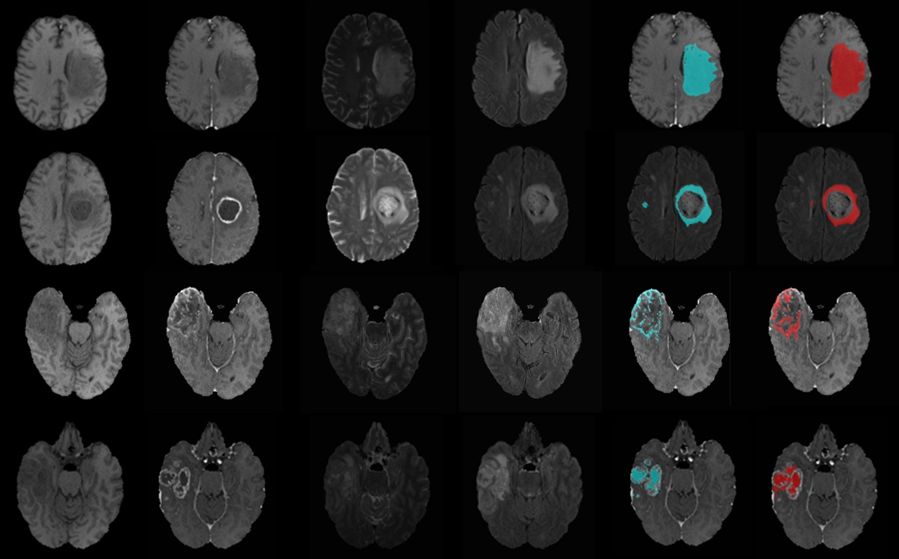

# Automatic Brain Tumour Regions Segmentation Using Modified U-Net

Medicine & Biology (Received: 28 February 2020, Accepted: 26 May 2020, Published: 26 July 2020)

## Authors

- Keerati Kaewrak \*
- John Soraghan
- Gaetano Di-Caterina
- Derek Grose

\* corresponding author (keerati.kaewrak@strath.ac.uk)

## Highlight text

Early diagnosis is an important key for brain tumour patients' survival. The segmentation of the tumour regions is done manually by the experts and it is time-consuming. In this work, we present a novel network architecture that automatically segments the whole tumour regions and intra-tumour structures (edema, enhancing tumour, necrotic and non-enhancing tumour). We evaluated the results using dice similarity coefficient and obtained promising results.

## Keywords

Automatic segmentation, brain tumour, U-Net

## Figure

Figure 1. Examples of MRI images and segmentation results from the test set. From left to right; multimodal MRI scans, ground truth mask (blue) and segmentation mask (red) overlaid on original MRI of the whole tumour, edema, enhancing tumour and necrotic and non-enhancing tumour.

## Abstract

### Background 

Glioma is the most common type of brain tumour found in both adults and children. Because tumour appearances vary from patient to patient, brain tumour segmentation represents a particularly challenging segmentation problem. Convolutional Neural Networks (CNNs) have become an efficient tool for image classification and segmentation including brain tumour segmentation (Menze et al. 2015). Conventional CNNs consist of convolutional layers, pooling layers and a fully connected layer stacked together to form a full CNNs architecture. A large amount of labelled data is required in order to train CNNs to work well on a specific task. However, in biomedical image classification and segmentation problems, the labelled dataset is limited. U-Net (Ronneberger et al. 2015) which is encoder-decoder network architecture was proposed to tackle this data limitation problem. For brain tumour segmentation, it is important to obtain precise locations of the tumour region. The global and local feature extraction paths from TwoPathCNNs network architecture (Havaei et al. 2016) allow the network to learn different aspects of the input data. These global and local feature extraction paths help to improve the segmentation classes’ prediction accuracy. Inspired by U-Net and TwoPathCNNs networks, we proposed a novel network architecture called Modified U-Net consisting of 3×3 and 9×9 convolutional layers as local and global feature extraction paths.

### Method

We trained and tested our proposed model on BRATs 2018 dataset which provides four MRI scans; T1-weighted (T1), T1-weighted with gadolinium-enhancing contrast (T1+Gd), T2-weighted and FLAIR image volumes from 210 high-grade and 70 low-grade glioma patients. These images were resampled and interpolated into 1×1×1 m3 with the size of 240×240×155 (Bakas et al. 2017).  We implemented the network using Tensorflow with Tensorlayer library.

### Result

We evaluate the results using dice similarity coefficient (DSC) = 2TP/(FP+2TP+FN), where TP, FP and FN denote the number of true positive, false positive and false negative counts. We obtain DSC of 0.83, 0.70, 0.69 and 0.45 accuracy for the whole tumour, enhancing tumour, edema and necrotic and non-enhancing tumour region, respectively. Figure 1 shows examples of original multimodal MRI scan (T1, T1+Gd, T2, FLAIR) compared with overlaid ground truth mask (blue) and segmentation mask (red) from the proposed model. 

### Discussion and conclusion

We proposed a novel encoder-decoder network architecture based on U-Net that had proved to work well in biomedical image segmentation. We trained and tested the proposed network on BRATs 2018 dataset. Without data augmentation, the proposed model achieved promising results for all tumour regions segmentation and was able to reduce segmentation runtime to just 1 minute per patient.

### About the authors

Miss Keerati Kaewrak is a PhD student under Professor John Soraghan and Dr. Gaetano Di Caterina supervision at Centre for Signal and Image Processing (CeSIP), Department of Electronic and Electrical Engineering, University of Strathclyde, Glasgow, United Kingdom. This work was done in collaboration with Dr. Derek Grose, consultant clinical oncologist and honorary senior lecturer at the Beatson West of Scotland Cancer Centre, Glasgow, United Kingdom. 

### Acknowledgements

This work was funded through the Development and Promotion of Science and Technology Talents Project (DPST), Royal Thai Government/University of Strathclyde research studentship with support from the NHS and Beatson Cancer Charity.  

### References

- Bakas, Spyridon, Hamed Akbari, Aristeidis Sotiras, Michel Bilello, Martin Rozycki, Justin S Kirby, John B Freymann, Keyvan Farahani, and Christos Davatzikos. 2017. “Advancing The Cancer Genome Atlas Glioma MRI Collections with Expert Segmentation Labels and Radiomic Features.” Scientific Data 4 (1): 170117. https://doi.org/10.1038/sdata.2017.117.
- Havaei, Mohammad, Francis Dutil, Chris Pal, Hugo Larochelle, and Pierre-Marc Jodoin. 2016. “A Convolutional Neural Network Approach to Brain Tumor Segmentation BT  - Brainlesion: Glioma, Multiple Sclerosis, Stroke and Traumatic Brain Injuries.” In , edited by Alessandro Crimi, Bjoern Menze, Oskar Maier, Mauricio Reyes, and Heinz Handels, 195–208. Cham: Springer International Publishing.
- Menze, B H, A Jakab, S Bauer, J Kalpathy-Cramer, K Farahani, J Kirby, Y Burren, et al. 2015. “The Multimodal Brain Tumor Image Segmentation Benchmark (BRATS).” IEEE Transactions on Medical Imaging 34 (10): 1993–2024. https://doi.org/10.1109/TMI.2014.2377694.
- Ronneberger, Olaf, Philipp Fischer, and Thomas Brox. 2015. “U-Net: Convolutional Networks for Biomedical Image Segmentation BT  - Medical Image Computing and Computer-Assisted Intervention – MICCAI 2015.” In , edited by Nassir Navab, Joachim Hornegger, William M Wells, and Alejandro F Frangi, 234–41. Cham: Springer International Publishing.

## License
 
This work is licensed under a Creative Commons Attribution-NonCommercial-ShareAlike 4.0 International (CC BY-NC-SA 4.0) License, which permits to copy and redistribute the material in any medium or format. You are also allowed to remix, transform, and build upon the material under the following terms: 1) You must give appropriate credit, provide a link to the license, and indicate if changes were made. 2) You may not use the material for commercial purposes. 3) If you remix, transform or build upon the material, you must distribute your contributions under the same license as the original. To view a copy of this license, visit https://creativecommons.org/licenses/by-nc-sa/4.0/