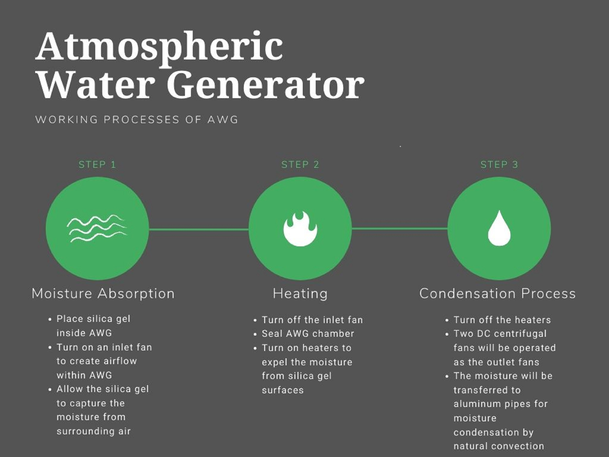

# Atmospheric Water Generator

Science & Engineering (Received: 29 February 2020, Accepted: 05 July 2020, Published: 26 July 2020)

## Second title

Water extraction from ambient air by using a Desiccant Based Atmospheric Water Generator 

## Authors

- Harit Keawmuang \*

\* corresponding author (skywalkgame@gmail.com)

## Highlight text

There are still many places in the world where safe drinkable water is not available. The reason mostly lies in not having enough freshwater resources and the cleanliness of the water. In order to solve these problems, an atmospheric water generator serves to produce clean potable water by using the concept of extracting water vapour from the air and condensing it into liquid water.  

## Keywords

Potable water, Atmospheric Water Generator, Air moisture, Condensation process, Silica gel

## Figure

A Working Process of AWG shows a conclusion of the working process of AWG machine in the form of diagram for more easily understanding.

## Abstract

### Background

Water is an essential element of life. Every living being depends on it for survival despite the fact that the amount of fresh water is limited and its quality has been constantly degrading. Water also plays an important role in the world’s socio-economic development as it is used in various purposes such as agriculture, food production, domestic use, and drinking. The water crisis is the situation which the amount of potable, unpolluted water within a region does not meet the needs of the people in that region. The United Nations had addressed that water scarcity will be a top priority in the upcoming decades as current strategies such as desalination and the use of water wells have their own multiple disadvantages. Thus, a new technique of obtaining potable water from the atmosphere through condensing water vapour has been a project of interest for many academics. This technique of obtaining potable water uses a machine called atmospheric water generator (AWG).
The AWG takes advantage of water vapour in the air and condensing it into liquid water. The key to capturing these water molecules lies in the use of a desiccant or a substance that adsorbs water. For this project, silica gel is to be used to act as a desiccant since it has the ability to absorb the moisture of up to 25% of its mass and it is most effective at temperatures below 25. The objectives of this work are to design and construct the solid adsorbent desiccation AWG prototype. The amount of water is expected to be as 580 ml per cycle since the efficiency test shows that with 2-3 kg of silica gel, the moisture content could be stored in silica gel to approximately 580 ml. Also, the main focus is to prove the new working concept of AWG that desiccant can be used as AWG’s base component. So, the cleanliness of water is not to be concerned. Furthermore, the factors affecting the amount of water produced by AWG is to be studied for further improvement.

### Method

The AWG prototype structure is designed into a rectangular box shape. The dimension of this structure is 17 inches x 18 inches x 22 inches, which has a total volume of approximately 6700 cubic inches. The body is made of five steel plates welded together. Hinges are installed between the sixth plate and the body in order to easily access inside of the AWG structure. The structure consisted of one circular opening for a 60 Watt inlet fan and two rectangular openings for two 12 volt DC FB blower centrifugal fans. Also, two of a thousand Watt heater are attached inside the structure. The four layers of horizontal bars, are welded to the structure and are where two kilograms worth of silica gels are placed on. Each outlet fan is then connected with a condensation tube, which placed outside the rectangular box. Condensation tube is an aluminium tube, which the length of the tubes is calculated by using the forced convection principle and given the relevant factors (e.g. temperatures, the expected amount of water, and time). The tubes are attach to the rectangular opening of the outlet fans of structure body.

Working process of AWG is divided into three phases. Moisture adsorption phase is the first step of the entire sections. In this phase, two kilograms of dry silica gel is divided up into 3 trays and placed inside the AWG to allow them to capture the moisture from the surrounding air. Next, the inlet fan is turned on to create airflow within the AWG. The duration of the experiment is about 3 hours, and the change in weight of the silica gel is recorded every 20 minutes. Then, the heating phase, after the silica gel is saturated with moisture, the colour of the silica gels will turn to pink, from its original colour: blue. In this phase, the inlet fan is turned off, the door of the AWG is closed to prevent leakage of moisture, the chamber then is well-insulated by electrical tape, and the two 1000 Watt heater is turned on to expel the moisture from silica gel surfaces. The heater is adjusted to be 170 degrees Celsius and left turned on until the silica gel have fully turned blue. From the experiment, the time it takes for the silica gel to reach its dry state is approximately 45 minutes. Once they turn blue, the temperature of the silica gel in each tray is measured. The condensation process, after the heating phase, the moisture is already evaporated off the silica gels, the chamber is now overflowed with the moisture. Next step, both 1000 Watt heaters are turned off and two DC centrifugal fans are turned on to absorb the intense moisture in the heating chamber and transfer it to the aluminium pipe for moisture condensation process by forced convection. Next, two plastic bags are to be attached to the end of the aluminium pipes in order to hold water obtained from the condensation process. The total energy consumption is approximately 6.303 kWh per 1 cycle.

### Result and Discussion

The results are separated into two parts. The first part gives the amount of moisture the silica gel could hold in the certain amount used. The result is to determine the efficiency of the silica gel. By weighing the silica gels periodically, the graph data is found, the trend of the data of total moisture content gradually increases and tends to increase further until the silica gel reaches the maximum moisture capacity and the efficiency of silica gels is 19.58%. The second part is related to the amount of water generated by AWG. For this section, all the procedures are run through. The volume of obtained water is recorded. Also, the related variables are observed. There are four trials conducted, each trail has a different weather condition and weight of silica gels. The first two trials are executed by using two kilograms of silica gels. The produced water is 8.8 ml and 7.75 ml respectively. Then, one kilogram of silica gel is added in the last two trails, the result are 9.3 ml and 8.6 ml. As an example, in order to compare the practice relevant factor to the theoretical one, the relative humidity at the end of the pipe is measured, which is 97.9%.

In the first trial, there are technical issues which prevented one of the heaters from operating. Thus, the aluminium condenser gains less heat during the heating process, allowing more water vapour to easily reach the dew point in the cooling phase compared to having both heaters operating in the second trial. The third trial, unsurprisingly, resulted in the highest amount of water obtained as more silica gel is bound to absorb more moisture. As for the performance of condensation process, the relative humidity at the end of the pipe, which is 97.9%, is acceptable since, at 100% relative humidity, the air is saturated and is at its dew point. However, the amount of water received, which the highest is 9.3 ml, is considerably lower than the theoretical value, which is 580 ml. This may be due to the aluminium pipe, which acts as a cooling chamber, not being cool enough to decrease the temperature of the water vapour down to the dew point.

### About the authors

Mr Harit Keawmuang is a Master’s Degree Mechanical Engineering student at Debrecen University in Hungary, also a graduated person from Bachelor’s Degree of Thammasat English Programme of Mechanical Engineering, Thailand. This project was done during the time in his Bachelor’s Degree and was supervised by Asst Prof Dr Sappinandana Akamphon, PhD (Mechanical Engineering), MIT, USA, who had an initial idea of conducting this work.

### Acknowledgements

I would like to express my deep and sincere gratitude to my project supervisor, Asst Prof Dr Sappinandana Akamphon, for giving me the opportunity to do this project and providing invaluable guidance throughout the project. 
Besides my advisor, I would like to thank the project committee which includes Asst Prof Dr Bunyong Rungroungdouyboon, Assoc Prof Dr Isares Dhuchakallaya and Assoc Prof Dr Watit Pakdee for their encouragement, insightful comments, and hard questions making better improvement of my project.
A special thanks to creative engineering design and development laboratory of Thammasat University for provided the equipment, measurement devices and suggestions needed for the project.
Last but not least, I am truly thankful to Thammasat English Programme of Engineering and Thammasat University for financial support. Furthermore, I grateful to all of the engineering faculty staff for doing all the works to make everything in this project went smoothly and also to the faculty’s technicians for giving all technical knowledge and guidance.

### References

- “Water scarcity”, United Nation, 2014, http://www.un.org/waterforlifedecade/scarcity.shtml.

## License

This work is licensed under a Creative Commons Attribution-NonCommercial-ShareAlike 4.0 International (CC BY-NC-SA 4.0) License, which permits to copy and redistribute the material in any medium or format. You are also allowed to remix, transform, and build upon the material under the following terms: 1) You must give appropriate credit, provide a link to the license, and indicate if changes were made. 2) You may not use the material for commercial purposes. 3) If you remix, transform or build upon the material, you must distribute your contributions under the same license as the original. To view a copy of this license, visit https://creativecommons.org/licenses/by-nc-sa/4.0/