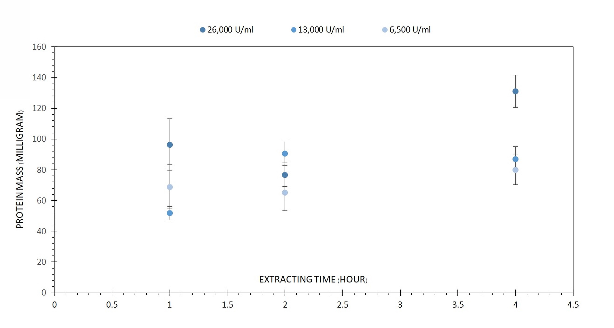

# Protein extraction from Rice bran 

Medicine & Biology (Received: 29 February 2020, Accepted: 05 July 2020, Published: 26 July 2020)

## Second title

The extraction of protein from plants using the cellulase enzyme. In addition, the extracted proteins were characterized including, protein solubility, proximate analysis, Fourier transform infrared spectrometer (FTIR), SDS-pages, emulsifying and foaming.

## Authors

- Suriphon Siwongsa \*

\* corresponding author (suriphons@icloud.com)

## Highlight text

Rice bran is a by-product of the rice milling process, which is classified as a waste. However, there has been research done earlier; found that rice bran contains a massive number of proteins when compared to other plants. The extraction of plant proteins using cellulase enzymes is considered because the great nutrition is revealed, in which there is a comparison of extraction in many circumstances to get the best conditions.

## Keywords

Rice brans protein, Enzymatic extraction, Rice bran optimization, Characterization of Rice protein 

## Figure

(A) The results of protein mass from cellulase activity: 6,500, 13,000 and 26,000 U/ml and the time used: 1, 2 and 4 hours. (B) The protein solubility results. (C) The FTIR results. (D) SDS-PAGE results for the extracted Rice brans proteins.

## Abstract

### Background

In recent years, there has been an increment in demand for functional food and market size of proteins and peptides in the Asia Pacific was up to 2,185 million US dollars in 2014 (Thamnarathip, et al. 2016). With increasing health and environmental concerns, plant-based proteins have become more popular. The problem associated with plant-based proteins is the less variety of amino acids each source can provide. Moreover, phytoestrogens (plant-produced estrogens) found in soy protein have been reported to affect the hormone level of a consumer. Hence, a variety of sources of plant-based protein are necessary. The quantity of the proteins extracted can be used to determine the viability of this extraction method for commercial uses. Rice brands, however, contain a large proportion of protein and there have been various reports regarding extraction of protein from rice bran. The extraction is often done after rice bran oil extraction. This seems to be advantageous as rice brans after the oil extraction are thrown away. Nevertheless, little work has been done on the extraction of protein from rice brans at a large scale.  

### Method

In this experiment, three enzyme amounts (cellulose) were investigated including 6500, 13,000 and 26,000 U/ml. As for the extracting time, initially, 4 hours is investigated, along with the extraction time for 2 hours and 1 hour. This will result in 9 total variations of unique conditions in the investigation of enzyme activity. 

10 grams of rice brans was mixed with 75 ml of distilled water. After that, the mixtures were then heated to 50oC for 30 minutes. Various enzyme activities and extracting time were used. The time longer than 4 hours was not considered as it would take too long for practical use in the industrial process (Watanabe et al., 1990). At the end of the extraction by the enzyme, each batch was then centrifuged at 3000 rpm for 30 minutes. Next, the supernatant layer was separated and the pH was adjusted to 10 in order to inactivate the enzyme. The protein solution was kept at 20oC. When this has been done, the protein solution was powdered using freeze-dry method. And this powder was then kept for further characterization; protein solubility, proximate analysis, FTIR, SDS-pages, emulsifying and foaming.

### Results

(A) the optimization part shows that the most effective enzyme activity and the time used in protein extraction from Sangyod rice brans are 26,000 U/ml and 4 hours respectively. Moreover, it is found that protein yield is only slightly increased after 4 hours. With regards to the protein mass contents, the optimum condition contains the highest protein amount, which is obtained 85.93 microgram protein on average from 20 microliters of the sample. Therefore, 0.322 gram of protein is obtained from 75 mL of the total sample solution, which is originally mixed with 10 grams of rice bran. (yield is approximately 3.22% on average). As can be seen from (B), pH influenced protein solubility remarkably. The minimum solubility is at about pH 3 and maximum solubility at pH 7 with the values of 31.5 % and 86.5 % respectively. In the FTIR result, the graph (C) from the data collected has peaks in the frequency range seen when a compound contains amide I and amide II bonds at between 1,647 and 1,412 cm-1 respectively. The protein profile of coloring rice brans is based on SDS-PAGE analysis, the rice brans protein are detected on SDS-PAGE with Foetal Brovine Serum staining, molecular weight of rice brans protein according to gel SDS-PAGE analysis. The sample is having MW between 57 - 69 kDa as shown in (D). About the proximate analysis, there are 32.5, 4.85, and 17.5 %w/w of the C, H, and N concentration. Also, ash content, moisture, crude fiber, fat, crude protein and %NFE are 6.02, 8.05, 2.31, 4.31, 17.71, and 69.65% respectively. Emulsifying activity index and emulsion stability index measured suggested that the rice bran based protein has slightly lower emulsifying properties than that of soy based protein. Foaming has also been investigated indicating a foaming ability of 5-6% and foaming stability of 50% for 10 minutes and 25% for 20 minutes.

### Discussion and Conclusion

This study of enzymatic extraction from rice brans is applied to Sangyod rice brans from Thailand, Cellulase enzymatic methodologies are applied as a substitution for alkaline and other extraction methods. In addition, this can be applied for industrial process of manufacturing protein supplements or other products for economic and social benefits. 
From the laboratory, it is found that the optimum condition is 50oC, the extraction time is 4 hours and the enzymatic activity is 26,000 U/ml. The result is intuitive since the increase in either the extraction time or the enzymatic activity simultaneously increases the protein yield in the experiments. Furthermore, this study also focuses on the characterization of the proteins that were extracted from the previous steps. This research has selected the methods that are important to the properties of the rice brans that will be important for mass production in this category of products.

### About the authors

Miss Suriphon Siwongsa is a former student of Thammasat University, Thailand (Bachelor’s degree) and currently studying in Master’s degree Chemical engineering of Budapest University of Technology and Economics in Hungary. This research was done when she was a Bachelor student in collaboration with Assoc Prof Dr Phanida Saikhwan, PhD, Cambridge, UK, from the Department of Chemical engineering, Thammasat School of engineering. Assoc. Prof. Dr Phanida Saikhwan is the major contributor to this work for the initial idea, project design, and laboratory experiments.

### Acknowledgements

This project acknowledges the funding support from Thammasat university research fund and the excellent support from Thammasat School of engineering and Mahidol University for the laboratory facilities.

### References

- Thamnarathip P, Nitisinprasert S, Vardhanabhuti, B. (2016) Identification of peptide molecular weight from rice bran protein hydrolysate with high antioxidant activity. Journal of Cereal Science, 69, 329–335.
- Watanabe Y, Ikeuchi Y, Tamai Y. (1990) Identification and characterization of a thermolabile antigen (TLAa, enolase) in Saccharomyces cerevisiae. Agric Biol Chem 54(10):2543-51.

## License
 
This work is licensed under a Creative Commons Attribution-NonCommercial-ShareAlike 4.0 International (CC BY-NC-SA 4.0) License, which permits to copy and redistribute the material in any medium or format. You are also allowed to remix, transform, and build upon the material under the following terms: 1) You must give appropriate credit, provide a link to the license, and indicate if changes were made. 2) You may not use the material for commercial purposes. 3) If you remix, transform or build upon the material, you must distribute your contributions under the same license as the original. To view a copy of this license, visit https://creativecommons.org/licenses/by-nc-sa/4.0/