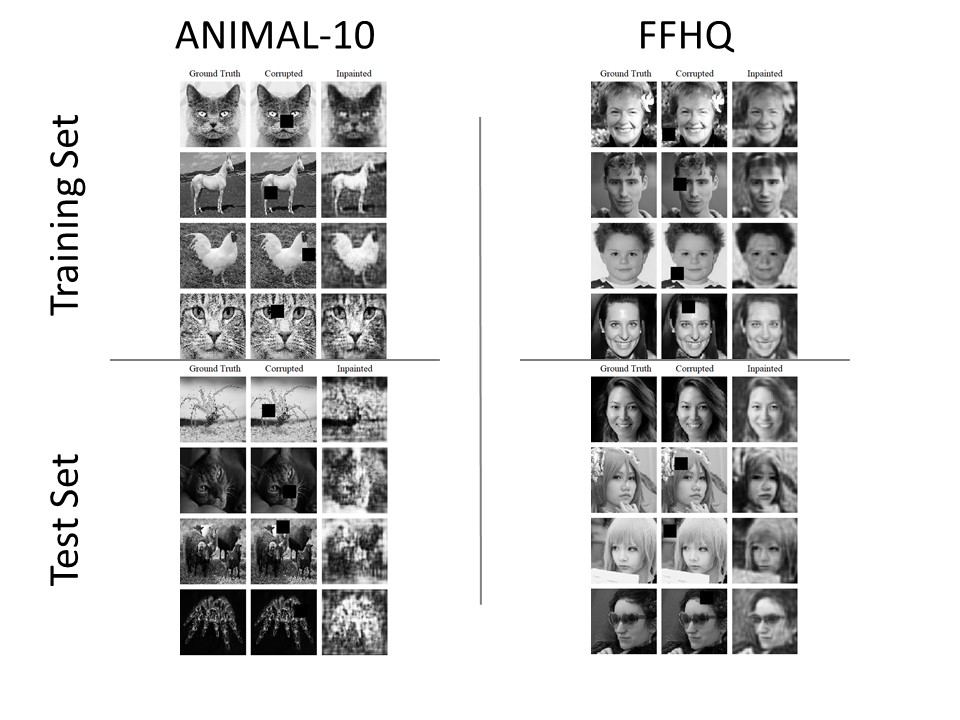

# Image Inpainting with Variational Autoencoders

Science & Engineering(Received: 01 March 2020, Accepted: 09 June 2020, Published: 26 July 2020)

## Second title

Restoring corrupted image with Variational Autoencoders, a machine learning technique

## Authors

- Sanhanat Deesamutara \*
- Federico Maggiore

\* corresponding author (cg226@stud.uni-heidelberg.de)

## Highlight text

This work presents the training methodology of variational autoencoder in order to restore the missing part of a corrupted image and question the requirement of homogeneity in the implementation and difference situation of corrupted data.

## Keywords

Image inpainting, Variational Autoencoders, Machine Learning, Image Processing

## Figure

| Dataset | SSIM(Train Set) | SSIM(Test Set) |
| --- | --- | --- |
| ANIMAL-10 | 0.8874±0.04929 | 0.6869±0.1606 |
| FFHQ | 0.9168±0.05239 | 0.9012±0.0537 |

Table 1 The result of autoencoders and the result of the different situations.

Results of reconstructed images via VAE, representing heterogeneity (ANIMAL-10) 
and homogeneity (FFHQ).

## Abstract

### Background 

Image inpainting is one of the image processing procedures used to restore corrupted images or videos. It is done by replacing the damaged region on the image using an interpolation function. It has been traditionally done by determination of the global picture of how to fill in the gap, which must be done by professional restorers. Nowadays, we can train the machine to be a professional painter itself with several algorithms, i.e. Generative Model (Yu et al., 2018), Adversarial Edge Learning (Nazeri et al., 2019) and Generalized PCA (Takahashi et al., 2016). In this study, an implementation of Variational Autoencoders (VAE) according to  the method presented by Ham et al.,2018 is performed,  in order to reconstruct occulted images from two different datasets: Animals-10 and FFHQ dataset. , grey-scaled, equal size with artificial occultation in order to compare the performance of algorithms on different datasets.

### Method

The code is developed in Python programming language; which is friendly with problems such as machine learning. The python code is combined with PyTorch (a library for Tensor algebra), GPU computing and Deep Learning. The repository is available at https://github.com/fedmag/DeepVision. Encoding layers are designed to mimic the VGG16 architecture, while the decoder is made under a re-elaboration of the DCGAN (Deep Convolutional Generative Adversarial Network) architecture. Concerning the dataset all images are transformed into the grayscale and resized into 100×100 pixels, regardless of the original ratio, we used such images as the ground-truths and split them ’randomly’ into training and test sets. We have added artificial damage to images by adding a black square to the image randomly.  We have set the first experiment, that occultation ratio corresponds to 20% of the image area. Both homogeneous and heterogeneous dataset are represented by 25,000 images of the training set and 2,000 images of the test set.  The homogeneous dataset is represented by Flickr-Faces-HQ Dataset (FFHQ) (https://github.com/NVlabs/ffhq-dataset), while the heterogeneity is subjected to Animal-10 Dataset (https://www.kaggle.com/alessiocorrado99/animals10). In the second experiment, we have set the 40% area of artificial damage to only one dataset which has better results. The occulted area is considered into two cases; 1x40% occulted square and 2x20% occulted square. In order to evaluate how good the results are, Structural similarity (SSIM) index is computed for every image, with their statistical values of SSIM for the various dataset. SSIM can be determined by the multiplication of 3 measurements which compare the similarity of two images in term of luminance, contrast and structure SSIM can be mathematically determined as follows,

### Result 

In this study, experiments have been performed, in order to consider the effect of homogeneity of the dataset to the result of autoencoders and the result of the different situations of the occultation, which is considered as corrupted region, the images of animals from ANIMAL-10 database are used to represent data with heterogeneity.  On the other hand, the representation of homogeneous data is faced from Flickr-Faces-HQ (FFHQ) database, which leads to the resulting Structural Similarity Index (SSIM) as shown in the table 1.

Observing the result, we have found that Variational Autoencoders provided better results with the homogeneous dataset. In the second experiment, the model was trained only once, i.e. for only 50 epochs, due to technical problems and limitation of time, on images with a 40% damage of the total area.  The model was then implemented into 2 situations: Image with a single 40% occulted square and image with two of 20% squares. The efficiency of the trained model is measured as 

- SSIM (40% square):  0.8692±0.0590
- SSIM (2×20% squares):  0.8553±0.0617

### Discussion and conclusion

To accomplish the goal of image inpainting, Variational Autoencoder requires data with homogeneity for inpainting on specific types of images.  However, we suffered technical problems such as the training time, the model, indeed, required more than 30 GPU-hours to evaluate all 350 epochs.  Nonetheless, the checkpoint file’s size was too large (approximately 3.5 GB) which often made resuming the training impossible. Thus, due to insufficient time, we could only deal with few cases of different occulting situations.  Further studies can be done with higher performance of computer and GPU (such as Titan or RTX series) for less computation time.  Some interesting developments might be achieved, for example, varying the shape of the occlusion, using RGB images, or enhancing the dataset (especially in the heterogeneity case it might improve the ability of the model to generalize). 

### About the authors

Mr Deesamutara is a master student in the Scientific Computing program of the Interdisciplinary Center for Scientific Computing (IWR) and Faculty of Mathematics and Computer Science, Heidelberg University, Germany. Mr Maggiore is a master student in the Faculty of Economics, Heidelberg University. Mr.Deesamutara and Mr.Maggiore have been working on this topic as the final project of the Deep Vision course, Summer semester2019.

### Acknowledgements

This work cannot be done without supervision from Prof. Björn Ommer, the lecturer of Deep Vision course in summer semester of 2019 and Mr. Johannes Haux, who was Prof. Ommer’s teaching assistant at that time.

### References

- Burlin, Charles, Yoann Le Calonnec, and Louis Duperier. n.d. "Deep Image Inpainting." http://cs231n.stanford.edu/reports/2017/pdfs/328.pdf.
- Erofeev, Mikhail. 2018. Image Inpainting: Humans vs. AI in Towards Data Science. https://towardsdatascience.com/image-inpainting-humans-vs-ai-48fc4bca7ecc.
- Fawzi, Alhussein, Horst Samulowitz, Deepak Turaga, and Pascal Frossard. 2016. "Image inpainting through neural networks hallucinations." 2016 IEEE 12th Image, Video, and Multidimensional Signal Processing Workshop (IVMSP). IEEE.
- Ham, Cusuh, Amit Raj, Vincent Cartillier, and Irfan Essa. 2018. "Variational Image Inpainting." GitHub. https://cusuh.github.io/papers/variational-image-inpainting.pdf.
- Nazeri, Kamyar, Eric Ng, Tony Joseph, Faisal Z. Qureshi, and Mehran Ebrahimi. 2019. "EdgeConnect: Generative Image Inpainting with Adversarial Edge Learning." arXiv. https://arxiv.org/abs/1901.00212.
- Pinho, Eduardo, and Carlos Costa. 2018. "Unsupervised Learning for Concept Detection in." Applied Sciences 1213.
- Radford, Alec, Luke Meetz, and Soumith Chintala. 2015. "Unsupervised Representation Learning with Deep Convolutional Generative Adversarial Networks." https://arxiv.org/abs/1511.06434}{arXiv:1511.06434.
- Simoyan, Karen, and Andrew Zisserman. 2014. "Very Deep Convolutional Networks for Large-Scale Image Recognition." Arxiv. https://arxiv.org/abs/1409.1556.
- Takahashi, Tomohiro, Katsumi Konishi, Kazunori Uruma, and Toshihiro Furukawa. 2016. "2016 IEEE 12th Image, Video, and Multidimensional Signal Processing Workshop (IVMSP)." 2016 IEEE 12th Image, Video, and Multidimensional Signal Processing Workshop (IVMSP). Bordeaux, France: IEEE.
- Yu, Jiahui, Zhe Lin, Jumei Yang, Xiaohui Shen, Xin Lu, and Thomas S Huang. 2018. "Generative Image Inpainting with Contextual Attention." arXiv. https://arxiv.org/abs/1801.07892.

### License

This work is licensed under a Creative Commons Attribution-NonCommercial-ShareAlike 4.0 International (CC BY-NC-SA 4.0) License, which permits to copy and redistribute the material in any medium or format. You are also allowed to remix, transform, and build upon the material under the following terms: 1) You must give appropriate credit, provide a link to the license, and indicate if changes were made. 2) You may not use the material for commercial purposes. 3) If you remix, transform or build upon the material, you must distribute your contributions under the same license as the original. To view a copy of this license, visit https://creativecommons.org/licenses/by-nc-sa/4.0/