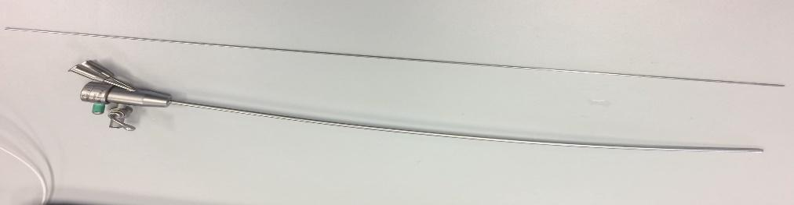
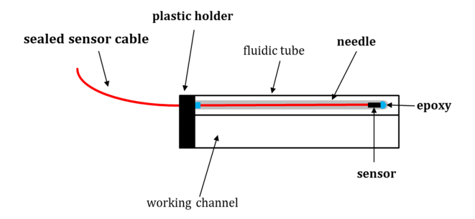

# Are modern surgical instruments really safe?

Science & Engineering (Received: 01 March 2020, Accepted: 10 June 2020, Published: 26 July 2020)

## Second title

Integrating EM sensor in fetoscope for real-time instrument tracking: Risk assessment

## Authors

- Wipharat Phokee \*
- Liliane Pintelon
- Emmanuel Vander Poorten

\* corresponding author (pwipha@kku.ac.th)

## Highlight text

The embedding of an electromagnetic (EM) sensor in the fetoscope is used to record the position and rotation of the tip of the fetoscope. However, this EM sensor can lead to risks for the patient (mother and fetus), surgeon and fetoscope. A failure mode and effects analysis (FMEA) method can identify and reduce the risk of medical errors in the fetoscope via a selective risk assessment, thereby improving patient (mother and fetus) safety, occupational health safety and ergonomics for surgeon and fetoscope.

## Keywords

FMEA, Risk assessment, Fetoscope, Twin-to-twin transfusion syndrome, Delphi

## Figure

Figure 1     The fetoscope, a minimally invasive surgical equipment, is inserted through the uterus and fetal membranes under ultrasound to coagulate the placental vessels responsible for the blood transfusion. The embedding of an EM sensor in the fetoscope with the magnetic field can be used to record the position and rotation of the tip of the fetoscope. In order to detect the sensor, a tabletop magnetic field generator is placed below the patient during the procedure.

Figure 2 The design of the embedding of an EM sensor in the fetoscope includes a hollow needle, an unsealed 6DOF sensor is inserted inside. The sensor is coated with a water-proof plastic tubing outside the needle. The sensor is sealed inside the needle with epoxy glue. The needle is attached to the fetoscope with a plastic holder. If necessary, the needle is removable from the fluidic tube and separately sterilizable (Aneta and Isabel 2019).

## Abstract

### Background

The twin-to-twin transfusion syndrome (TTTS) is caused by sharing an unbalanced placental vascularization between monochorionic twins in their own amniotic sac (Legrand et al. 2019)(On behalf of the International Collaboration to Harmonise Outcomes for Twin-Twin Transfusion Syndrome (CHOOSE) et al. 2017). Without intervention, the perinatal mortality rate exceeds 90% in TTTS twins and survivors may have severely damaged (Legrand et al. 2019) (Winkler, Harrison, and Messersmith 2019). Over the last decade, fetoscopic laser ablation (FLA) has become the standard treatment, resulting in excellent outcomes for severe TTTS (Legrand et al. 2019; On behalf of the International Collaboration to Harmonise Outcomes for Twin-Twin Transfusion Syndrome (CHOOSE) et al. 2017)(Malshe et al. 2017)(Papanna et al. 2014). The embedding of an electromagnetic (EM) sensor in the fetoscope has the advantage that the position and rotation of the tip of the fetoscope can be very well controlled. The EM sensor, at the tip of the fetoscope, stays inside the range of the magnetic field. The sensor is mounted on the tip of the fetoscope for more continuous and accurate EM navigation. However, it can lead to risks for the patient (mother and fetus), surgeon and fetoscope. To reduce the risk of medical errors in a fetoscope, a selective risk assessment can be done, thereby reducing the risks and improving patient (mother and fetus) safety, occupational health safety and ergonomics for surgeon and fetoscope. A failure mode and effects analysis (FMEA) is a risk assessment tool to identify and analyze risk in healthcare systems, the FMEA method is widely accepted and employed to analyze healthcare system (Liu 2019)(McElroy et al. 2016). This method identifies and analyzes potential failure modes by experts that have knowledge and experience on the specific topic for TTTS and then calculate risk priority number (RPN) for severity, occurrence and detectability. 

### Method

The data necessary to perform the risk assessment is collected by the Delphi method, in which five expert engineers are needed. In round one, we identified the issues via an interview, thereby setting the project objectives and defining all their responsibilities. Round two consisted of the analysis, by interviewing the experts, calculation of the RPN by analyzing potential failure effects (S), potential failure causes (O) and current control (D). 

### Result

The study found that the embedding of an EM sensor in the fetoscope consisted of 29 failure modes. The highest potential failure mode was the needle and glued sensor (17%) followed by the tubing (14%), handle (14%), epoxy (14%), sensor (14%) and fetoscope (10%). The fetoscope (30%) itself had the highest number of potential failure effects, followed by potential failure effects for surgeons (24%), mothers (23%) and the fetus (23%). However, the highest RPN was a fetoscope (48.89) followed by the fetus (37.33) and mother (31.50).

### Discussion and conclusion

The highest potential failure mode was the needle and glued sensor and the highest of potential effects was the handle of the fetoscope. However, the fetoscope showed the highest RPN. Mother and fetus were more important for patient safety but fetoscope was material damage. Reducing risk factors of integrating electromagnetic (EM) sensor in the fetoscope could follow by; for the fetoscope was concerned about the presence of metallic components disturbing the field caused by noise’s sensor was concerned about the embedding of an EM sensor in the fetoscope. For the fetus, they concerned about improper handling or too high strain would cause of crack and break of the tube. For surgeon related to ergonomics, they had an increasing mental stress from extended intervention or longer procedure from replacing instruments and electrical shock because of the noise of the sensor.

### About the authors

Miss Wipharat is a doctoral student, promoted by Prof. Liliane Pintelon, Department of Mechanical Engineering, Faculty of Engineering Science, KU Leuven and Prof. Emmanuel Vander Poorten, Mechanical Engineering Technology, Group T Leuven Campus, KU Leuven. 

### Acknowledgements

WP acknowledges the support from the Royal Thai Government Scholarship.

### References

- Aneta, Kloudová, and Isabel Montón Quesada. 2019. “Integrating EM sensor in fetoscope for real time instrument tracking.” Master of Science in Biomedical Engineering, KU Leuven.
- Legrand, Julie, Allan Javaux, Mouloud Ourak, Dirk Wenmakers, Tom Vercauteren, Jan Deprest, Sebastien Ourselin, Kathleen Denis, and Emmanuel Vander Poorten. 2019. “Handheld Active Add-On Control Unit for a Cable-Driven Flexible Endoscope.” Frontiers in Robotics and AI 6 (September 20). doi:10.3389/frobt.2019.00087. https://www.frontiersin.org/article/10.3389/frobt.2019.00087/full.
- Liu, Hu-Chen. 2019. Improved FMEA Methods for Proactive Healthcare Risk Analysis.
- Malshe, A., S. Snowise, L. K. Mann, N. Boring, A. Johnson, M. W. Bebbington, K. J. Moise, and R. Papanna. 2017. “Preterm Delivery after Fetoscopic Laser Surgery for Twin-Twin Transfusion Syndrome: Etiology and Risk Factors: PTD after Laser Surgery in TTTS.” Ultrasound in Obstetrics & Gynecology 49 (5) (May): 612–616. doi:10.1002/uog.15972.
- McElroy, Lisa M, Rebeca Khorzad, Anna P Nannicelli, Alexandra R Brown, Daniela P Ladner, and Jane L Holl. 2016. “Failure Mode and Effects Analysis: A Comparison of Two Common Risk Prioritisation Methods.” BMJ Quality & Safety 25 (5) (May): 329–336. doi:10.1136/bmjqs-2015-004130.
- On behalf of the International Collaboration to Harmonise Outcomes for Twin–Twin Transfusion Syndrome (CHOOSE), Asma Khalil, Helen Perry, James Duffy, Keith Reed, Ahmet Baschat, Jan Deprest, et al. 2017. “Twin–Twin Transfusion Syndrome: Study Protocol for Developing, Disseminating, and Implementing a Core Outcome Set.” Trials 18 (1) (July 14). doi:10.1186/s13063-017-2042-0. http://trialsjournal.biomedcentral.com/articles/10.1186/s13063-017-2042-0.
- Papanna, R., D. Block-Abraham, L. K. Mann, I. A. Buhimschi, M. Bebbington, E. Garcia, N. Kahlek, et al. 2014. “Risk Factors Associated with Preterm Delivery after Fetoscopic Laser Ablation for Twin-Twin Transfusion Syndrome: Risk Factors Associated with PTD after FLA for TTTS.” Ultrasound in Obstetrics & Gynecology 43 (1) (January): 48–53. doi:10.1002/uog.13206.
Winkler, Sally M., Michael R. Harrison, and Phillip B. Messersmith. 2019. “Biomaterials in Fetal Surgery.” Biomaterials Science 7 (8): 3092–3109. doi:10.1039/C9BM00177H.

## License

This work is licensed under a Creative Commons Attribution-NonCommercial-ShareAlike 4.0 International (CC BY-NC-SA 4.0) License, which permits to copy and redistribute the material in any medium or format. You are also allowed to remix, transform, and build upon the material under the following terms: 1) You must give appropriate credit, provide a link to the license, and indicate if changes were made. 2) You may not use the material for commercial purposes. 3) If you remix, transform or build upon the material, you must distribute your contributions under the same license as the original. To view a copy of this license, visit https://creativecommons.org/licenses/by-nc-sa/4.0/