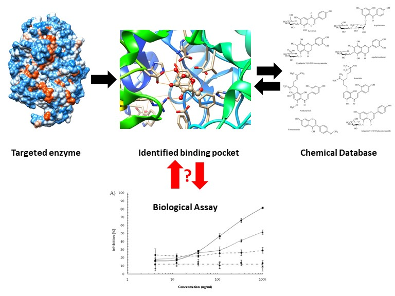

# A critical step in applying a computational approach for drug discovery under the new outbreak situation

Medicine & Biology (Received: 01 March 2020, Accepted: 08 June 2020, Published: 26 July 2020)

## Second title

An awareness of uncorrelated and correlated results between in silico and in vitro studies from the identification of enzyme inhibitors

## Authors

- Thanet Pitakbut (TP) \*
- Sukanya Dej-adisai (SD) \*

\* corresponding authors (TP:thanet.pitakbut@tu-dortmund.de, SD:sukanya.d@psu.ac.th)

## Highlight text

The urgency of the drug discovery against viral infection is raising after the emergence of 2019 new coronavirus epidemic in China. The traditional drug discovery requires years of operation. Therefore, the fast-track strategy has been proceeded by applying a computer-based approach. However, the correlation between this approach and its biological activity is a great concern. The aim of this study is to provide an awareness of this correlation.

## Keywords

A computational approach in drug discovery, in silico, in vitro and enzyme inhibitor

## Figure

A computational approach for drug discovery

## Abstract

### Background

The 2019 novel coronavirus (COVID-19) outbreak has not only affected the global economy but also international societies. Until now, there is neither standard treatment nor vaccine available. More importantly, the numbers of infected patients are escalating internationally. Therefore, this is an urgent issue to identify the cure. After the potential drug targeted protein, namely proteinase enzyme, from new coronavirus was reported, a computer-based approach combining with deep learning has begun to search for the treatment from the known clinically - approved drugs (Zhavoronkov, et al. 2020). Since this approach can overcome the time-sensitive challenge of the outbreak by quickly identifying the potential candidates and comprehensively providing structure-related properties. However, sometimes, there are uncorrelated phenomena that take place when it comes to the transition from a prediction from a computer to an actual experiment (Rafael, et al. 2011).  In this research, we hereby demonstrate the correlation between in silico and in vitro studies, which is an essential step in this cutting - edge technology applying in the drug discovery process, by presenting the example of using a computer-based approach to identify inhibitors from the targeted enzyme and their biological inhibition.

### Method

For the computational approach, Autodock Vina version 1.1.2 from the Script Research Institute, San Diego, California, USA was used. The targeted protein and chemical structure of interesting compounds were downloaded from the NCBI protein databank and PubChem database, respectively. The docking parameters were configured according to the previous studies. Finally, the bioassay protocol was followed by the previous work of authors (Dej-adisai, et al. 2017).

### Result

Two related chemotype groups, one aromatic and three aromatic rings systems, were used in this study. In a preliminary evaluation, the result indicates a poor correlation between the prediction and the actual experiment at R2 = 0.46 from both groups. However, the correlation could be improved up to R2 = 0.77 after the elimination of one false positive from the computer prediction. For the deep analysis, we found that three aromatic rings system showed a strong correlation up to R2 = 0.86. Whereas one aromatic ring system exhibited a very poor correlation around R2 = 0.07. In addition, one compound that belongs to this one ring system was shown as a false positive. However, the false positive could be presented here but it was only less than 10%. As a result, this finding demonstrates the huge impact of the chemical structure, even in the related group, on the prediction from the computer-based approach.

### Discussion and conclusion

Due to the fast development in technology, especially in the computational approach, this allows us to be able to take immediate response to a search for the cure for this outbreak, COVID-19. Even in this cutting-edge technology, there are still points to be concerned. One of the critical steps is to determine the correlation between the prediction from the computer-based approach and the biological tests from the actual experiment. Therefore, this study has shown that one chemotype may have more favourable than the other one even there are related. It is necessary to take a closer look at the deeper analysis before making a conclusion. Even though the computational prediction may report a false positive occasionally, this approach still provides a huge benefit in terms of time and cost-effectiveness.

### About the authors

Mr Thanet Pitakbut is currently working as a PhD student at Technical Biochemistry Laboratory, Department of Biochemical and Chemical Engineering, Technical University Dortmund University, Dortmund, Germany. However, this study was conducted at Assistant Professor Dr Sukanya Dej-adisai Laboratory, Department of Pharmacognosy and Pharmaceutical Botany, Faculty of Pharmaceutical Sciences, Prince of Songkla University, Hat-Yai, Thailand. Mr Thanet Pitakbut and Assistant Professor Dr Sukanya Dej-adisai are the major contributors to this work.

### Acknowledgements

The authors would like to acknowledge the financial support from the Plant Genetic Conservation Project under The Royal Initiative of Her Royal Highness Princess Maha Chakri Sirindhorn (RSPG). Finally, special thanks to Prof Dr Adelheid Brantner from the Department of Pharmacognosy, Institute of Pharmaceutical Sciences, University of Graz, Austria for standard compounds. 

### References

- Dej-adisai, Sukanya; Pitakbut, Thanet and Wattanapiromsakul, Chatchai. "Alpha-glucosidase inhibitory activity and phytochemical investigation of Borassus flabellifer Linn." The African Journal of Pharmacy and Pharmacology 1(3). 2017: 45-52.
- Rafael V.C. Guido, Glaucius Oliva and Adriano D. Andricopulo. 2011. “Modern Drug Discovery Technologies: Opportunities and Challenges in Lead Discovery.” Combinatorial Chemistry & High Throughput Screening 14 (10): 830 - 839.
- Zhavoronkov, Alex; Aladinskiy, Vladimir; Zhebrak, Alexander; Zagribelnyy, Bogdan; Terentiev, Victor; Bezrukov, Dmitry S.; et al. 2020. “Potential COVID-2019 3C-like Protease Inhibitors Designed Using Generative Deep Learning Approaches.” ChemRxiv. Preprint. https://doi.org/10.26434/chemrxiv.11829102.v2

## License

This work is licensed under a Creative Commons Attribution-NonCommercial-ShareAlike 4.0 International (CC BY-NC-SA 4.0) License, which permits to copy and redistribute the material in any medium or format. You are also allowed to remix, transform, and build upon the material under the following terms: 1) You must give appropriate credit, provide a link to the license, and indicate if changes were made. 2) You may not use the material for commercial purposes. 3) If you remix, transform or build upon the material, you must distribute your contributions under the same license as the original. To view a copy of this license, visit https://creativecommons.org/licenses/by-nc-sa/4.0/