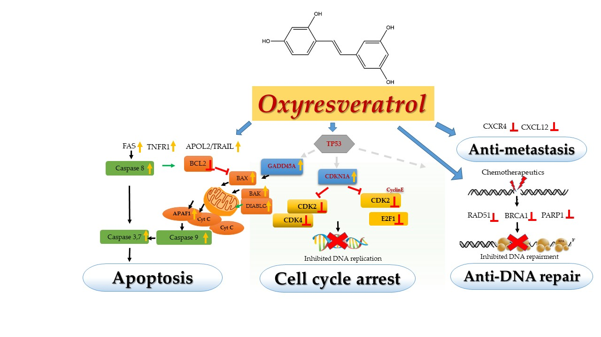

# Anti-cancer property from a Thai medicinal plant

Medicine & Biology (Received: 21 March 2020, Accepted: 30 May 2020, Published: 26 July 2020)

## Second title

Oxyresveratrol: Anti-cancer breast cancer and the mechanism of actions

## Authors

- Sarayut Radapong (SR) \*
- Satyajit D. Sarker
- Kenneth J. Ritchie (KJR) \*

\* corresponding authors (SR: S.Radapong@2017.ljmu.ac.uk, KJR: K.J.Ritchie@ljmu.ac.uk)

## Highlight text

Oxyresveratrol poses potent cytotoxicity to several kinds of cancer cells. The compound moderated various molecular alterations of breast cancer cells including apoptosis, cell proliferation, metastasis and cancer repair pathways. Interestingly, Oxyresveratrol down-regulates RAD51 and genes in homologous recombination, which breaks the mechanism of self-repair resulting in overcoming the drug resistance.

## Keywords

Oxyresveratrol, Artocarpus lakoocha, Anti-cancer, mechanism, microarray

## Figure

Oxyresveratrol (OXY) posed cytotoxicity to MCF-7, breast cancer cells by moderating the genes mainly on apoptosis or programmed cell death by activating the key genes both extrinsic and intrinsic pathways via dead receptors (FAS, TNFR1 and APOL2/TRAIL) and mitochondrial apoptotic genes (BAX, BAK, DIABLO and APAF1), respectively through the caspase cascade. Cyclin-dependent kinases(CDKs) are the main enzymes playing the crucial role in cell proliferation including CDK2, CDK4 and cyclin proteins, which were also suppressed by OXY resulting in blocking DNA synthesis in G1 and S phase and the cell cycle was subsequently arrested. OXY also inhibited the expression of CXCR4 and its ligand (CXCL12) causing anti-cell spreading or metastasis. Most importantly, OXY inhibited the genes in the cancer DNA repair pathway; the most affected were RAD51 and genes in homologous recombination.

## Abstract

### Background

Breast cancer is a major cause of cancer-related deaths. It is estimated that over 9.6 million deaths from cancer in 2018 (WHO 2020, n.p.). Anti-cancer drugs are normally used in all stages of cancer development, but the failure treatment may occur from chemoresistance (Shender et al 2018, 473). Oxyresveratrol (OXY) is a naturally occurring polyphenol belonging to the group of the stilbenoids, which is richest in Artocarpus lakoocha’s heartwood, an indigenous plant in Thailand (Mongolsuk et al 1957, 2231). OXY has been shown to possess various potent bioactivities with the main property being an antioxidant, anti-inflammatory, tyrosinase inhibition, anti-virus and anti-cancer (Chatsumpun et al 2016, 488; Rahman et al 2017, 23).  In consideration of its chemical structure, which is similar to the well-known antioxidant, resveratrol, this compound may share the anti-cancer property. The previous report found this compound posed cytotoxicity to human hormone-dependent breast cancer (T47D), human cervical adenocarcinoma (HeLa), human non-small-cell lung carcinoma (A549) (Chatsumpun et al 2016, 488). The evidence of the anticarcinogenic activity of OXY has been reported. However, the precise mechanism involved in the modulation of carcinogenesis remains to be elucidated.

### Method

The cytotoxicity of OXY was evaluated on several cancerous and non-cancerous cells using MTT (3-(4,5-Dimethylthiazol-2-yl)-2,5-diphenyltetrazolium bromide) cytotoxicity assays. Microarray Human Clariom S arrays (a 400 format array) (Affymetrix Inc., Santa Clara, California, USA), following the manufacturer’s recommendations, was then implemented to elucidate the genes and biological pathways altered in MCF-7, human breast cancer cells treated with two different OXY concentrations (50 μM and 100 μM) for 24 h. Quantitative polymerase chain reaction and western blot analysis were then used to confirm the gene expression. 

### Result

OXY displayed dose- and time-dependent cytotoxicity on human breast cancer cells (MCF-7) and then the cells were subsequently exposed to OXY. By using Transcriptome Analysis Console (TAC) Software (Thermo Fisher Scientific, California, USA), A total of 686 genes were found to have altered mRNA expression levels of two-fold or more in the 50 μM OXY-treated group (262 upregulated and 424 downregulated genes).  Total 2,338 genes were found to be differentially expressed in the 100 µM-treated group (907 upregulated and 1,431 downregulated genes).  Interestingly, OXY was found to moderate the genes mainly in apoptosis or programmed cell death by activating the key genes both extrinsic and intrinsic pathways via dead receptors (FAS, TNFR1 and APOL2/TRAIL) and mitochondrial apoptotic genes (BAX, BAK, DIABLO and APAF1), respectively through caspase cascade. Cyclin-dependent kinases(CDKs) are the main enzymes playing the crucial role in cell proliferation including CDK2, CDK4 and cyclin proteins, which were also suppressed by OXY resulting in blocking DNA synthesis in G1 and S phases and the cell cycle was subsequently arrested. OXY also inhibited the expression of CXCR4 and its ligand (CXCL12) causing anti-cell spreading or metastasis. Most importantly, OXY inhibited the genes in the cancer DNA repair pathway; the most affected were RAD51 and genes in homologous recombination, which can break the mechanism of self-repair resulting in overcoming the drug resistance.

### Discussion and conclusion

OXY moderated genes in the key pathways of cancer hallmarks including apoptosis, cell proliferation, metastasis and cancer repair pathways. Downregulation of RAD51 and some genes in homologous recombination may be the key role of self-repair causing cancer resistance (Leon-Galicia et al 2018, 3025). OXY has the potential to be a promising anticancer drug or help overcome chemotherapeutics resistance.   

### About the authors

Sarayut is a doctoral student in Prof Satyajit D. Sarker and Dr Kenneth J. Ritchie’s phytochemicals laboratory at Centre for Natural Products Discovery, School of Pharmacy and Biomolecular Sciences, Liverpool John Moores University, Byrom Street, Liverpool L3 3AF, UK. 

### Acknowledgements

The authors acknowledge the support from The Royal Thai government, Thailand
 (Project number: R253184) and the excellent support from Liverpool John Moores University for the laboratory facilities.

### References

- WHO. 2020. n.d. Breast cancer. Accessed 5 30, 2020. http:// www.who.int/cancer/prevention/diagnosis-screening/breast-cancer/en/
- Chatsumpun, Nutputsorn, Taksina Chuanasa, Boonchoo Sritularak, Vimolmas Lipipun, Vichien Jongbunprasert, Somsak Ruchirawat, Poonsakdi Ploypradith, and Kittisak Likhitwitayawuid. 2016. "Oxyresveratrol: Structural Modification and Evaluation of Biological Activities." Molecules 21(4): 488-489.
- Leon-Galicia, I., J. Diaz-Chavez, M. E. Albino-Sanchez, E. Garcia-Villa, R. Bermudez-Cruz, J. Garcia-Mena, L. A. Herrera, A. Garcia-Carranca, and P. Gariglio. 2018. "Resveratrol Decreases Rad51 Expression and Sensitizes Cisplatin-Resistant Mcf-7 Breast Cancer Cells." Oncol. Rep 39(6): 3025-3033.
- Mongolsuk, S., Alexander Robertson, and R. Towers. 1957. "2,3',4,5'-Tetrahydroxystilbene from Artocarpus Lakoocha." J. Chem. Soc : 2231-2233.
- Rahman, Md Ataur, Kausik Bishayee, Ali Sadra, and Sung-Oh Huh. 2017. "Oxyresveratrol Activates Parallel Apoptotic and Autophagic Cell Death Pathways in Neuroblastoma Cells." Biochim. Biophys. Acta, Gen. Subj 1861(2): 23-36.
- Shender, V. O., G. P. Arapidi, M. S. Pavlyukov, P. V. Shnaider, K. S. Anufrieva, G. A. Stepanov, and V. M. Govorun. 2018. "The Role of Intercellular Communication in Cancer Progression." Russ. J. Bioorg. Chem 44(5): 473-80.

## License

This work is licensed under a Creative Commons Attribution-NonCommercial-ShareAlike 4.0 International (CC BY-NC-SA 4.0) License, which permits to copy and redistribute the material in any medium or format. You are also allowed to remix, transform, and build upon the material under the following terms: 1) You must give appropriate credit, provide a link to the license, and indicate if changes were made. 2) You may not use the material for commercial purposes. 3) If you remix, transform or build upon the material, you must distribute your contributions under the same license as the original. To view a copy of this license, visit https://creativecommons.org/licenses/by-nc-sa/4.0/